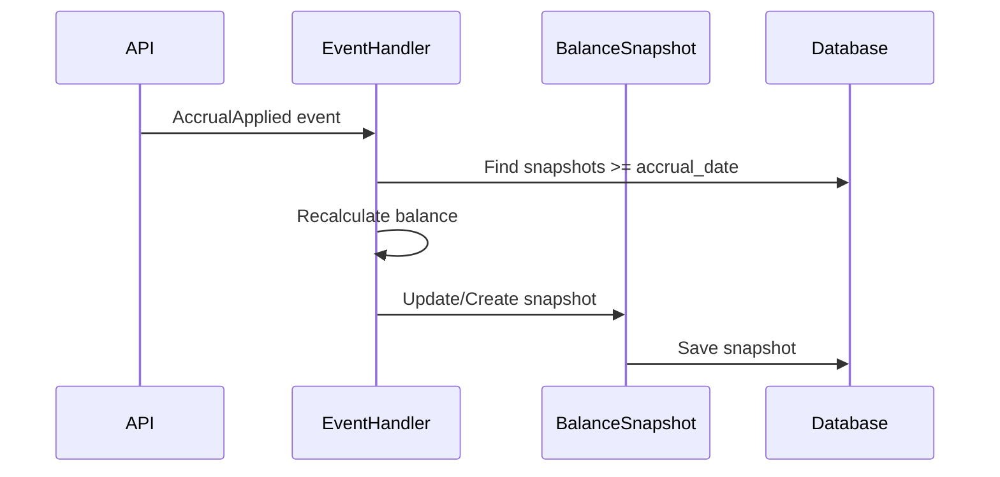

# ADR-0004: CQRS для баланса — Snapshots и Event-driven обновление

## 1. Контекст

**Проблема производительности:** При росте количества операций (500+ участков × 5+ лет = 25000+ начислений и платежей) каждый запрос баланса выполняет `SUM()` по всей истории операций. Это становится узким местом при:
- Запросе баланса на текущую дату
- Запросе баланса на историческую дату (для отчётности)
- Массовом расчёте балансов для всех субъектов СТ (отчёт «Оборотно-сальдовая ведомость»)

**Текущее состояние (Фаза 2):** BalanceRepository использует агрегатные провайдеры (IAccrualAggregateProvider, IPaymentAggregateProvider) для расчёта баланса через `SUM(accruals) - SUM(payments)`. Это чисто read-модель, но вычисляется «на лету».

## 2. Требования

- **R1:** Запрос баланса на текущую дату должен выполняться ≤ 50 мс
- **R2:** Запрос баланса на историческую дату должен выполняться ≤ 100 мс
- **R3:** Поддержка снимков баланса на любую дату (для отчётности)
- **R4:** Автоматическое обновление снимков при финансовых событиях

## 3. Event Storming

**Команды:**
- `CreateAccrual` → `AccrualCreated`
- `ApplyAccrual` → `AccrualApplied`
- `CancelAccrual` → `AccrualCancelled`
- `CreatePayment` → `PaymentCreated`
- `ConfirmPayment` → `PaymentConfirmed`
- `CancelPayment` → `PaymentCancelled`

**Read-модель:**
- `BalanceSnapshot` — снимок баланса на дату

**Process:**
```
AccrualApplied → UpdateBalanceSnapshot
PaymentConfirmed → UpdateBalanceSnapshot
AccrualCancelled → UpdateBalanceSnapshot
PaymentCancelled → UpdateBalanceSnapshot
```

## 4. Решение

### 4.1 Таблица `balance_snapshots`

```sql
CREATE TABLE balance_snapshots (
    id UUID PRIMARY KEY,
    financial_subject_id UUID NOT NULL REFERENCES financial_subjects(id),
    snapshot_date DATE NOT NULL,
    total_accruals NUMERIC(12,2) NOT NULL,
    total_payments NUMERIC(12,2) NOT NULL,
    balance NUMERIC(12,2) NOT NULL,
    created_at TIMESTAMPTZ NOT NULL DEFAULT NOW(),
    updated_at TIMESTAMPTZ NOT NULL DEFAULT NOW(),
    UNIQUE (financial_subject_id, snapshot_date)
);

CREATE INDEX idx_balance_snapshots_subject_date 
    ON balance_snapshots(financial_subject_id, snapshot_date);
```

### 4.2 Обновление снимков (Write)

**Подход:** Event-driven обработчики обновляют снимки при событиях.

```python
# financial_core/application/event_handlers.py

class UpdateBalanceSnapshotOnAccrualApplied:
    @handle(AccrualApplied)
    async def handle(self, event: AccrualApplied):
        # Найти последний snapshot до event.accrual_date
        # Пересчитать баланс на event.accrual_date
        # Обновить или создать snapshot
        pass
```

**Важно:** Обновлять только снимки на даты >= даты события. Прошлые снимки не менять (история сохраняется).

### 4.3 Чтение баланса (Read)

**Алгоритм:**
1. Поиск snapshot на `as_of_date`
2. Если найден — вернуть из snapshot
3. Если не найден — fallback на расчёт из операций (текущая логика)

```python
async def calculate_balance(self, financial_subject_id, as_of_date):
    # Try snapshot first
    snapshot = await self._get_snapshot(financial_subject_id, as_of_date)
    if snapshot:
        return Balance.from_snapshot(snapshot)
    
    # Fallback to calculation from operations
    total_accruals = await self.accrual_provider.sum_participating(...)
    total_payments = await self.payment_provider.sum_participating(...)
    return Balance(total_accruals, total_payments)
```

### 4.4 Закрытие периодов

**Дополнительно:** При закрытии финансового периода (Фаза 4) создавать обязательный snapshot на последний день периода. Это «замораживает» баланс для отчётности.

## 5. Диаграммы

### Контекстная диаграмма

```mermaid
C4Context
    title C1: Balance Snapshots Context

    Person_1("Бухгалтер", "Председатель СТ")
    System_1("Controlling API", "Система учёта СТ")
    Database_1("balance_snapshots", "Снимки балансов")
    Database_2("accruals, payments", "Финансовые операции")

    Rel(1, 2, "GET /balance?as_of_date=X")
    Rel(2, 3, "Read snapshot")
    Rel(2, 4, "Calculate from operations (fallback)")
    Rel(5, 3, "Update on event", "Event-driven")
```

### Процесс обновления



## 6. План реализации

| Этап | Задача | Оценка |
|------|--------|--------|
| 1 | Создать ORM модель `BalanceSnapshotModel` | 0.5 сессии |
| 2 | Написать миграцию Alembic | 0.5 сессии |
| 3 | Создать `BalanceSnapshot` entity и repository | 1 сессия |
| 4 | Реализовать event handlers (Accrual, Payment) | 2 сессии |
| 5 | Обновить `BalanceRepository` (snapshot + fallback) | 1 сессия |
| 6 | Написать тесты (event-driven + fallback) | 1 сессия |
| 7 | Создать скрипт для initial snapshots (история) | 1 сессия |

**Итого:** 7 сессий

## 7. Риски

| Риск | Вероятность | Влияние | Митигация |
|------|-------------|---------|-----------|
| Дублирование snapshot | Низкая | Среднее | UNIQUE constraint на (subject_id, snapshot_date) |
| Неправильный пересчёт | Средняя | Высокое | Тесты на event handlers + сверка с расчётом из операций |
| Отставание snapshots | Низкая | Среднее | Мониторинг последних snapshot по каждому subject |

## 8. Альтернативы

### 8.1 Materialized View

**Плюсы:**
- Автоматическое обновление (при REFRESH)
- Прозрачно для приложения

**Минусы:**
- Требует REFRESH (полный или incremental)
- Сложнее с историческими датами

**Решение:** Не подходит — нужны снимки на произвольные даты, не только текущая.

### 8.2 Ledger (двойная запись)

**Плюсы:**
- Полный аудит
- Баланс всегда сходится

**Минусы:**
- Требует полного рефакторинга финансовой модели
- Выходит за рамки MVP

**Решение:** Отложить на пост-MVP (см. ADR 0002).

## 9. Владелец

- **Команда:** Backend
- **Техлид:** @Lead Architect
- **Статус:** Черновик (Фаза 2, не реализовано)

---

*Дата: 2026-03-20*
*Статус: Proposed → Accepted (после реализации Фазы 4)*
