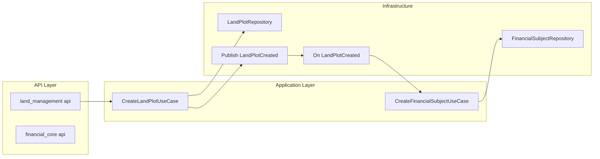

# План миграции backend в Clean Architecture (модульная структура)

**Цель:** рефакторинг backend (FastAPI + SQLAlchemy) в модульную Clean/Hexagonal архитектуру с bounded contexts: вынос домена и сервисов в слой, независимый от фреймворка, с явными контрактами и Domain Events для независимой разработки модулей разными командами.

---

## Важное уточнение по стеку

В проекте используется **FastAPI + SQLAlchemy + Pydantic**, а не Django. План адаптирован под этот стек:
- **API слой**: FastAPI `APIRouter`, Pydantic-схемы (вместо DRF ViewSets/Serializers).
- **Инфраструктура**: SQLAlchemy ORM-модели, репозитории на async `AsyncSession`.
- **Историзация**: уже реализована через SQLAlchemy event listeners и таблицы `*_history` ([`backend/app/db/history_events.py`](backend/app/db/history_events.py), [`backend/app/models/history.py`](backend/app/models/history.py)); не требуется замена на django-simple-history.
- **Зависимости и конфиг**: `app.config`, `app.db.session`, `app.api.deps` остаются общими; роутеры подключаются в `app.main`.

---

## 1. Анализ текущей структуры

### 1.1 Модели (слой данных)

| Текущий путь | Сущность | cooperative_id | Историзация |
|--------------|----------|----------------|-------------|
| [`app/models/cooperative.py`](backend/app/models/cooperative.py) | Cooperative | — (корневая) | нет |
| [`app/models/land_plot.py`](backend/app/models/land_plot.py) | LandPlot | да, index | нет |
| [`app/models/owner.py`](backend/app/models/owner.py) | Owner | нет | нет |
| [`app/models/plot_ownership.py`](backend/app/models/plot_ownership.py) | PlotOwnership | нет | да (events) |
| [`app/models/financial_subject.py`](backend/app/models/financial_subject.py) | FinancialSubject | да, index | нет |
| [`app/models/contribution_type.py`](backend/app/models/contribution_type.py) | ContributionType | нет | нет |
| [`app/models/accrual.py`](backend/app/models/accrual.py) | Accrual | через FS | да (events) |
| [`app/models/payment.py`](backend/app/models/payment.py) | Payment | через FS | да (events) |
| [`app/models/expense_category.py`](backend/app/models/expense_category.py) | ExpenseCategory | нет | нет |
| [`app/models/expense.py`](backend/app/models/expense.py) | Expense | да, index | да (events) |
| [`app/models/meter.py`](backend/app/models/meter.py) | Meter | нет | нет |
| [`app/models/meter_reading.py`](backend/app/models/meter_reading.py) | MeterReading | нет | нет |
| [`app/models/app_user.py`](backend/app/models/app_user.py) | AppUser | опционально | нет |
| [`app/models/history.py`](backend/app/models/history.py) | *History (4 таблицы) | — | — |

**Проверка правил:**
- **FinancialSubject как ядро**: Accrual и Payment ссылаются только на `financial_subject_id` (и `payer_owner_id` у Payment) — без прямых FK на LandPlot/Meter. Соответствует правилу.
- **Мультитенантность**: в сервисах и API везде передаётся `cooperative_id`, выборки фильтруются по нему (напрямую или через join с FinancialSubject).
- **Историзация**: PlotOwnership, Accrual, Payment, Expense уже пишут историю через `history_events.py`.

### 1.2 API (роутеры и эндпоинты)

| Файл | Роль |
|------|------|
| [`app/api/v1/auth.py`](backend/app/api/v1/auth.py) | Логин, текущий пользователь |
| [`app/api/v1/cooperatives.py`](backend/app/api/v1/cooperatives.py) | CRUD СТ |
| [`app/api/v1/owners.py`](backend/app/api/v1/owners.py) | CRUD владельцев |
| [`app/api/v1/land_plots.py`](backend/app/api/v1/land_plots.py) | Участки + права собственности |
| [`app/api/v1/financial_subjects.py`](backend/app/api/v1/financial_subjects.py) | Список ФС, балансы |
| [`app/api/v1/contribution_types.py`](backend/app/api/v1/contribution_types.py) | Справочник видов взносов |
| [`app/api/v1/accruals.py`](backend/app/api/v1/accruals.py) | Начисления |
| [`app/api/v1/payments.py`](backend/app/api/v1/payments.py) | Платежи |
| [`app/api/v1/expenses.py`](backend/app/api/v1/expenses.py) | Расходы |
| [`app/api/v1/meters.py`](backend/app/api/v1/meters.py) | Счётчики и показания |
| [`app/api/v1/reports.py`](backend/app/api/v1/reports.py) | Отчёты (должники, cash flow) |

### 1.3 Бизнес-логика (сервисы)

| Файл | Зависимости от моделей/других сервисов |
|------|----------------------------------------|
| [`app/services/cooperative_service.py`](backend/app/services/cooperative_service.py) | Cooperative |
| [`app/services/owner_service.py`](backend/app/services/owner_service.py) | Owner |
| [`app/services/land_plot_service.py`](backend/app/services/land_plot_service.py) | FinancialSubject, LandPlot, PlotOwnership — **создаёт FinancialSubject при создании участка** |
| [`app/services/balance_service.py`](backend/app/services/balance_service.py) | FinancialSubject, Accrual, Payment |
| [`app/services/accrual_service.py`](backend/app/services/accrual_service.py) | Accrual, FinancialSubject (join по cooperative_id) |
| [`app/services/payment_service.py`](backend/app/services/payment_service.py) | Payment, FinancialSubject (join) |
| [`app/services/expense_service.py`](backend/app/services/expense_service.py) | Expense, ExpenseCategory |
| [`app/services/meter_service.py`](backend/app/services/meter_service.py) | Meter, MeterReading, FinancialSubject, LandPlot (для cooperative_id) |
| [`app/services/report_service.py`](backend/app/services/report_service.py) | Много моделей (агрегация) |

**Кросс-модульные зависимости:**
- `land_plot_service`: при создании участка создаёт запись FinancialSubject — заменить на **Domain Event** `LandPlotCreated`; обработчик в financial_core создаёт FinancialSubject.
- `meter_service`: определяет `cooperative_id` через LandPlot или Payment/FinancialSubject — заменить на событие/запрос по контракту (например, событие `MeterCreated` + обработчик в financial_core создаёт FinancialSubject; cooperative_id передаётся в событии или получается через интерфейс «разрешить cooperative_id по owner_id» из land_management).
- `report_service`: читает данные из нескольких доменов — оставить как application-слой reporting, который зависит от репозиториев/интерфейсов своих и (через контракты) других модулей или от read-моделей/событий.

### 1.4 Схемы (DTO)

Все в [`app/schemas/`](backend/app/schemas/): cooperative, owner, land_plot, plot_ownership, financial_subject, contribution_type, accrual, payment, expense, meter, balance, report, auth.

### 1.5 Общая инфраструктура

- [`app/db/base.py`](backend/app/db/base.py) — Base, Guid.
- [`app/db/session.py`](backend/app/db/session.py) — get_db, async engine.
- [`app/db/history_events.py`](backend/app/db/history_events.py) — регистрация слушателей истории.
- [`app/core/security.py`](backend/app/core/security.py) — JWT.
- [`app/api/deps.py`](backend/app/api/deps.py) — get_current_user, require_role.
- [`app/config.py`](backend/app/config.py) — настройки.

---

## 2. Целевая структура (дерево модулей)

Итоговая структура `backend/app/`:

```text
app/
├── config.py
├── main.py
├── api/
│   └── deps.py
├── core/
│   └── security.py
├── db/
│   ├── base.py
│   ├── session.py
│   ├── history_events.py
│   └── register_models.py   # импорт всех module models для Alembic
├── modules/
│   ├── shared/
│   │   ├── kernel/
│   │   │   ├── entities.py      # BaseEntity, ValueObject (опц.)
│   │   │   ├── repositories.py  # IRepository (ABC)
│   │   │   ├── exceptions.py    # DomainError, ValidationError
│   │   │   └── events.py        # DomainEvent base
│   │   └── multitenancy/
│   │       └── context.py       # cooperative_id из контекста (JWT/deps)
│   │
│   ├── cooperative_core/
│   │   ├── domain/           # pure Python, без FastAPI/SQLAlchemy
│   │   │   ├── entities.py
│   │   │   └── repositories.py # ICooperativeRepository
│   │   ├── application/
│   │   │   ├── dtos.py
│   │   │   └── use_cases.py
│   │   ├── infrastructure/
│   │   │   ├── models.py      # SQLAlchemy Cooperative
│   │   │   └── repositories.py
│   │   └── api/
│   │       ├── routes.py
│   │       └── schemas.py
│   │
│   ├── land_management/
│   │   ├── domain/
│   │   │   ├── entities.py    # LandPlot, Owner, PlotOwnership
│   │   │   ├── repositories.py
│   │   │   └── events.py      # LandPlotCreated, OwnerChanged
│   │   ├── application/
│   │   │   ├── dtos.py
│   │   │   └── use_cases.py   # CreateLandPlotUseCase, TransferOwnershipUseCase
│   │   ├── infrastructure/
│   │   │   ├── models.py      # LandPlot, Owner, PlotOwnership + history
│   │   │   ├── repositories.py
│   │   │   └── events.py      # публикация LandPlotCreated после commit
│   │   └── api/
│   │       ├── routes.py
│   │       └── schemas.py
│   │
│   ├── financial_core/
│   │   ├── domain/
│   │   │   ├── entities.py    # FinancialSubject, Balance (value)
│   │   │   ├── repositories.py
│   │   │   └── services.py    # BalanceCalculator (domain logic)
│   │   ├── application/
│   │   │   ├── dtos.py
│   │   │   └── use_cases.py   # CreateFinancialSubjectUseCase, GetBalanceUseCase
│   │   ├── infrastructure/
│   │   │   ├── models.py      # FinancialSubject
│   │   │   ├── repositories.py
│   │   │   └── event_handlers.py # подписка на LandPlotCreated, MeterCreated
│   │   └── api/
│   │       ├── routes.py
│   │       └── schemas.py
│   │
│   ├── accruals/
│   │   ├── domain/
│   │   │   ├── entities.py    # Accrual, ContributionType
│   │   │   └── repositories.py
│   │   ├── application/
│   │   │   ├── dtos.py
│   │   │   └── use_cases.py
│   │   ├── infrastructure/
│   │   │   ├── models.py      # Accrual, ContributionType + AccrualHistory
│   │   │   └── repositories.py
│   │   └── api/
│   │       ├── routes.py
│   │       └── schemas.py
│   │
│   ├── payments/
│   │   ├── domain/
│   │   │   ├── entities.py
│   │   │   └── repositories.py
│   │   ├── application/
│   │   │   ├── dtos.py
│   │   │   └── use_cases.py
│   │   ├── infrastructure/
│   │   │   ├── models.py      # Payment + PaymentHistory
│   │   │   └── repositories.py
│   │   └── api/
│   │       ├── routes.py
│   │       └── schemas.py
│   │
│   ├── meters/
│   │   ├── domain/
│   │   │   ├── entities.py    # Meter, MeterReading
│   │   │   └── repositories.py
│   │   ├── application/
│   │   │   ├── dtos.py
│   │   │   └── use_cases.py   # RecordMeterReadingUseCase, CreateMeterUseCase
│   │   ├── infrastructure/
│   │   │   ├── models.py
│   │   │   ├── repositories.py
│   │   │   └── events.py      # MeterCreated
│   │   └── api/
│   │       ├── routes.py
│   │       └── schemas.py
│   │
│   ├── expenses/
│   │   ├── domain/
│   │   │   ├── entities.py    # Expense, ExpenseCategory
│   │   │   └── repositories.py
│   │   ├── application/
│   │   │   ├── dtos.py
│   │   │   └── use_cases.py
│   │   ├── infrastructure/
│   │   │   ├── models.py      # Expense, ExpenseCategory + ExpenseHistory
│   │   │   └── repositories.py
│   │   └── api/
│   │       ├── routes.py
│   │       └── schemas.py
│   │
│   ├── reporting/
│   │   ├── domain/
│   │   │   └── services.py    # доменная логика отчётов (если есть)
│   │   ├── application/
│   │   │   └── use_cases.py   # GenerateDebtorReportUseCase, GenerateCashFlowUseCase
│   │   ├── infrastructure/
│   │   │   └── read_models.py # опционально: запросы к репозиториям других модулей через интерфейсы
│   │   └── api/
│   │       ├── routes.py
│   │       └── schemas.py
│   │
│   └── administration/
│       ├── domain/
│       │   └── entities.py    # AppUser (pure)
│       ├── application/
│       │   └── use_cases.py
│       ├── infrastructure/
│       │   └── models.py      # AppUser
│       └── api/
│           ├── routes.py     # auth
│           └── schemas.py
└── scripts/                    # без изменений, вызов через app.modules...
```

Слои и правила:

- **Domain**: только pure Python (dataclasses/классы, типы, UUID, Decimal, datetime). Запрещены импорты: FastAPI, SQLAlchemy, Pydantic, других модулей (кроме `shared.kernel`).
- **Application**: use cases, DTOs (Pydantic можно здесь), валидация. Может импортировать domain текущего модуля и shared. Запрещены импорты infrastructure и api текущего модуля, а также других модулей (связь только через события/интерфейсы).
- **Infrastructure**: SQLAlchemy-модели, репозитории (реализация интерфейсов из domain), публикация/подписка на Domain Events. Может импортировать domain и application текущего модуля. Запрещены импорты моделей других модулей (допускается FK по строке имени таблицы, например `ForeignKey("cooperatives.id")`).
- **API**: FastAPI router, Pydantic-схемы для HTTP. Может импортировать application и infrastructure текущего модуля.

---

## 3. Маппинг файлов (текущий путь → новый путь)

| Текущий путь | Слой | Новый путь |
|--------------|------|------------|
| `app/models/cooperative.py` | infrastructure | `app/modules/cooperative_core/infrastructure/models.py` |
| `app/schemas/cooperative.py` | api | `app/modules/cooperative_core/api/schemas.py` |
| `app/services/cooperative_service.py` | application | `app/modules/cooperative_core/application/use_cases.py` (часть) |
| `app/api/v1/cooperatives.py` | api | `app/modules/cooperative_core/api/routes.py` |
| — | domain | `app/modules/cooperative_core/domain/entities.py` (Cooperative dataclass) |
| — | domain | `app/modules/cooperative_core/domain/repositories.py` (ABC) |
| `app/models/land_plot.py` | infrastructure | `app/modules/land_management/infrastructure/models.py` |
| `app/models/owner.py` | infrastructure | `app/modules/land_management/infrastructure/models.py` |
| `app/models/plot_ownership.py` | infrastructure | `app/modules/land_management/infrastructure/models.py` |
| `app/models/history.py` (PlotOwnershipHistory) | infrastructure | `app/modules/land_management/infrastructure/models.py` (или оставить в shared) |
| `app/schemas/land_plot.py`, plot_ownership.py, owner.py | api | `app/modules/land_management/api/schemas.py` |
| `app/services/land_plot_service.py`, owner_service.py | application | `app/modules/land_management/application/use_cases.py` |
| `app/api/v1/land_plots.py`, owners.py | api | `app/modules/land_management/api/routes.py` |
| `app/models/financial_subject.py` | infrastructure | `app/modules/financial_core/infrastructure/models.py` |
| `app/schemas/financial_subject.py`, balance.py | api | `app/modules/financial_core/api/schemas.py` |
| `app/services/balance_service.py` | application + infrastructure | `app/modules/financial_core/application/use_cases.py` + репозиторий в infrastructure |
| `app/api/v1/financial_subjects.py` | api | `app/modules/financial_core/api/routes.py` |
| `app/models/contribution_type.py` | infrastructure | `app/modules/accruals/infrastructure/models.py` |
| `app/models/accrual.py` | infrastructure | `app/modules/accruals/infrastructure/models.py` |
| `app/models/history.py` (AccrualHistory) | infrastructure | `app/modules/accruals/infrastructure/models.py` или shared |
| `app/schemas/accrual.py`, contribution_type.py | api | `app/modules/accruals/api/schemas.py` |
| `app/services/accrual_service.py` | application | `app/modules/accruals/application/use_cases.py` |
| `app/api/v1/accruals.py`, contribution_types.py | api | `app/modules/accruals/api/routes.py` |
| `app/models/payment.py` | infrastructure | `app/modules/payments/infrastructure/models.py` |
| PaymentHistory | infrastructure | `app/modules/payments/infrastructure/models.py` |
| `app/schemas/payment.py` | api | `app/modules/payments/api/schemas.py` |
| `app/services/payment_service.py` | application | `app/modules/payments/application/use_cases.py` |
| `app/api/v1/payments.py` | api | `app/modules/payments/api/routes.py` |
| `app/models/meter.py`, meter_reading.py | infrastructure | `app/modules/meters/infrastructure/models.py` |
| `app/schemas/meter.py` | api | `app/modules/meters/api/schemas.py` |
| `app/services/meter_service.py` | application | `app/modules/meters/application/use_cases.py` |
| `app/api/v1/meters.py` | api | `app/modules/meters/api/routes.py` |
| `app/models/expense.py`, expense_category.py | infrastructure | `app/modules/expenses/infrastructure/models.py` |
| ExpenseHistory | infrastructure | `app/modules/expenses/infrastructure/models.py` |
| `app/schemas/expense.py` | api | `app/modules/expenses/api/schemas.py` |
| `app/services/expense_service.py` | application | `app/modules/expenses/application/use_cases.py` |
| `app/api/v1/expenses.py` | api | `app/modules/expenses/api/routes.py` |
| `app/schemas/report.py` | api | `app/modules/reporting/api/schemas.py` |
| `app/services/report_service.py` | application | `app/modules/reporting/application/use_cases.py` |
| `app/api/v1/reports.py` | api | `app/modules/reporting/api/routes.py` |
| `app/models/app_user.py` | infrastructure | `app/modules/administration/infrastructure/models.py` |
| `app/schemas/auth.py` | api | `app/modules/administration/api/schemas.py` |
| `app/api/v1/auth.py` | api | `app/modules/administration/api/routes.py` |
| `app/db/history_events.py` | — | Оставить в `app/db/`, обновить импорты на модульные модели (или перенести регистрацию в каждый модуль). |

Историзация: таблицы `*_history` и логика в `history_events.py` остаются; при переносе моделей в модули обновляются только импорты в `history_events.py` (имена таблиц не менять, чтобы миграции БД не ломались).

---

## 4. Пошаговое выполнение (этапы)

### Этап 1: Shared kernel и база

- Создать `modules/shared/kernel/`: `entities.py` (BaseEntity, при необходимости ValueObject), `repositories.py` (IRepository ABC), `exceptions.py`, `events.py` (DomainEvent base).
- Создать `modules/shared/multitenancy/context.py` — хелпер для получения `cooperative_id` из текущего пользователя (из deps).
- Оставить `app/db/base.py`, `session.py` без изменений; добавить `app/db/register_models.py`, который импортирует все модели из `modules/*/infrastructure/models.py` для Alembic; в `alembic/env.py` заменить `import app.models` на импорт `register_models` (чтобы все таблицы попали в `Base.metadata`).

### Этап 2: Cooperative Core

- Domain: entities (Cooperative), repositories (ICooperativeRepository).
- Application: DTOs, use cases (create, get, list, update, delete).
- Infrastructure: SQLAlchemy-модель Cooperative (без relationship на другие модули), CooperativeRepository.
- API: routes, schemas; подключить router в `main.py`.

Проверка: domain не импортирует FastAPI/SQLAlchemy; API вызывает use cases.

### Этап 3: Land Management

- Domain: LandPlot, Owner, PlotOwnership (entities), репозитории, события LandPlotCreated, OwnerChanged.
- Application: use cases (create land plot, get, list by cooperative, update, create/update ownerships).
- Infrastructure: модели LandPlot, Owner, PlotOwnership (FK только по имени таблицы, например `cooperatives.id`), репозитории; после создания участка публиковать LandPlotCreated (in-process bus или вызов зарегистрированного handler'а).
- API: routes (land_plots, owners), schemas.

Убрать создание FinancialSubject из use case создания участка; перенести в обработчик события в financial_core.

### Этап 4: Financial Core

- Domain: FinancialSubject, Balance (value), репозитории, доменный сервис расчёта баланса (по суммам начислений/платежей).
- Application: use cases (create financial subject, get balance, list by cooperative); CreateFinancialSubject вызывается из event handler'а.
- Infrastructure: модель FinancialSubject, репозиторий; подписка на LandPlotCreated (и позже MeterCreated) — создание FinancialSubject в той же или отдельной транзакции по политике проекта.
- API: routes (financial-subjects, balances), schemas.

Проверка: Accrual/Payment нигде не ссылаются на LandPlot/Meter, только на financial_subject_id.

### Этап 5: Accruals

- Domain: Accrual, ContributionType (entities), репозитории.
- Application: use cases (create, apply, cancel, list by cooperative / by financial subject), массовое создание.
- Infrastructure: модели Accrual, ContributionType, AccrualHistory; репозитории; все запросы по cooperative через join с FinancialSubject и фильтр cooperative_id.
- API: routes (accruals, contribution-types), schemas.

### Этап 6: Payments

- Domain: Payment (entity), репозитории.
- Application: use cases (register, cancel, get by id, list by cooperative / by financial subject / by owner).
- Infrastructure: Payment, PaymentHistory, репозитории; фильтр по cooperative_id через join с FinancialSubject.
- API: routes, schemas.

### Этап 7: Meters

- Domain: Meter, MeterReading (entities), репозитории.
- Application: use cases (create meter, record reading, get/list). При создании счётчика не импортировать LandPlot/FinancialSubject — передавать cooperative_id в DTO или публиковать MeterCreated (subject_type, subject_id=meter_id, cooperative_id); financial_core создаёт FinancialSubject.
- Infrastructure: Meter, MeterReading, репозитории; при необходимости публикация MeterCreated.
- API: routes, schemas.

### Этап 8: Expenses

- Domain: Expense, ExpenseCategory (entities), репозитории.
- Application: use cases (create, get, list by cooperative, confirm/cancel).
- Infrastructure: Expense, ExpenseCategory, ExpenseHistory, репозитории; все запросы с `cooperative_id`.
- API: routes, schemas.

### Этап 9: Reporting

- Application: use cases (debtors report, cash flow) — вызывают репозитории/интерфейсы financial_core, accruals, payments, expenses (через внедрённые интерфейсы или фасады read-only, без прямого импорта чужих моделей).
- Infrastructure: при необходимости read-модели или запросы только через интерфейсы других модулей.
- API: routes, schemas.

### Этап 10: Administration (auth)

- Domain: AppUser (entity).
- Application: use cases (login, get current user).
- Infrastructure: AppUser model, репозиторий.
- API: auth routes, schemas; deps остаются в `app.api.deps`, используют репозиторий/use case из administration.

### Этап 11: Роутинг и миграции

- В `main.py` подключать только роутеры из `modules/*/api/routes.py`.
- Удалить старые каталоги `app/models`, `app/schemas`, `app/services`, старые `app/api/v1/*` (после переноса).
- `alembic/env.py`: метаданные из `register_models`; проверить `alembic revision --autogenerate` без лишних изменений (имена таблиц те же).
- Обновить `app/db/history_events.py`: импорты сущностей из соответствующих модулей (или оставить один централизованный файл, импортирующий из модулей).

### Этап 12: Тесты и проверочный лист

- Обновить импорты в тестах (conftest, test_api, test_services, test_models).
- Проверить: все запросы с `cooperative_id`; историзация для PlotOwnership, Accrual, Payment, Expense; в domain нет импортов FastAPI/SQLAlchemy; FinancialSubject — единственная связь для Accrual/Payment; межмодульные связи только через события/интерфейсы.

---

## 5. Проверочный лист после миграции

- [ ] Все ORM-модели находятся в `modules/{module}/infrastructure/models.py` (или в shared для истории, с явным решением).
- [ ] В domain ни одного модуля нет импортов FastAPI, SQLAlchemy, Pydantic (допустимы только стандартная библиотека, typing, uuid, decimal, datetime и shared.kernel).
- [ ] FinancialSubject — ядро финансов: Accrual и Payment ссылаются только на `financial_subject_id` (и payer_owner_id у Payment).
- [ ] Все выборки, затрагивающие мультитенантность, фильтруются по `cooperative_id` (напрямую или через join с FinancialSubject).
- [ ] Историзация: PlotOwnership, Accrual, Payment, Expense пишут в соответствующие `*_history` таблицы (текущий механизм SQLAlchemy events сохранён).
- [ ] Межмодульные связи: land_management не создаёт FinancialSubject напрямую; financial_core подписан на LandPlotCreated (и при необходимости MeterCreated); reporting не импортирует модели других модулей, только интерфейсы/use cases.
- [ ] В коде и документации нет упоминаний Django; везде FastAPI, SQLAlchemy, Pydantic.
- [ ] Миграции БД: имена таблиц не изменены; при необходимости только добавлены новые; данные не теряются.
- [ ] Удаление финансовых записей: только смена статуса на `cancelled`/`archived`, без физического DELETE для Accrual, Payment, Expense.

---

## 6. Диаграмма потоков (межмодульное взаимодействие)



---

## 7. Риски и смягчение

| Риск | Смягчение |
|------|------------|
| Потеря функциональности при переносе | Перед удалением старого кода — тесты и ручная проверка сценариев; бизнес-логику переносить в use cases, не оставлять в routes. |
| Циклические импорты | Строго соблюдать правила слоёв; между модулями — только события и абстрактные интерфейсы в shared. |
| Миграции ломают данные | Не менять имена таблиц и колонок; при рефакторинге только переносить код; при необходимости — данные миграции без изменения схемы. |
| Утечка данных между СТ | В каждом репозитории и use case проверять передачу cooperative_id и фильтрацию в запросах; добавить в код-ревью и тесты. |

Документ `docs/architecture/clean-architecture-migration-prompt.md` после миграции можно обновить: убрать все упоминания Django, DRF, django-simple-history и привести примеры к FastAPI/SQLAlchemy/Pydantic.

---

## 8. Чеклист выполнения (отмечать по ходу работы)

### Этап 1 — Shared kernel и база

- [ ] `modules/shared/kernel/entities.py` — BaseEntity
- [ ] `modules/shared/kernel/repositories.py` — IRepository (ABC)
- [ ] `modules/shared/kernel/exceptions.py` — DomainError, ValidationError
- [ ] `modules/shared/kernel/events.py` — DomainEvent (base)
- [ ] `modules/shared/multitenancy/context.py` — хелпер cooperative_id из JWT
- [ ] `app/db/register_models.py` — централизованный импорт всех infrastructure-моделей для Alembic
- [ ] `alembic/env.py` переключён с `import app.models` на `import app.db.register_models`

### Этап 2 — Cooperative Core

- [ ] `cooperative_core/domain/entities.py` — Cooperative (pure Python dataclass)
- [ ] `cooperative_core/domain/repositories.py` — ICooperativeRepository (ABC)
- [ ] `cooperative_core/application/dtos.py`
- [ ] `cooperative_core/application/use_cases.py` — create, get, list, update, delete
- [ ] `cooperative_core/infrastructure/models.py` — SQLAlchemy CooperativeModel
- [ ] `cooperative_core/infrastructure/repositories.py` — CooperativeRepository
- [ ] `cooperative_core/api/schemas.py`
- [ ] `cooperative_core/api/routes.py` — router подключён в `main.py`
- [ ] Проверка: domain не содержит импортов FastAPI/SQLAlchemy/Pydantic

### Этап 3 — Land Management

- [ ] `land_management/domain/entities.py` — LandPlot, Owner, PlotOwnership
- [ ] `land_management/domain/repositories.py` — интерфейсы репозиториев
- [ ] `land_management/domain/events.py` — LandPlotCreated, OwnerChanged (dataclasses)
- [ ] `land_management/application/dtos.py`
- [ ] `land_management/application/use_cases.py` — CreateLandPlotUseCase, TransferOwnershipUseCase
- [ ] `land_management/infrastructure/models.py` — LandPlot, Owner, PlotOwnership, PlotOwnershipHistory
- [ ] `land_management/infrastructure/repositories.py`
- [ ] `land_management/infrastructure/events.py` — публикация LandPlotCreated (in-process event bus)
- [ ] `land_management/api/schemas.py`
- [ ] `land_management/api/routes.py` — land_plots + owners; router в `main.py`
- [ ] Создание FinancialSubject удалено из use case создания участка (перенесено в financial_core через событие)

### Этап 4 — Financial Core

- [ ] `financial_core/domain/entities.py` — FinancialSubject, Balance (value object)
- [ ] `financial_core/domain/repositories.py`
- [ ] `financial_core/domain/services.py` — BalanceCalculator (pure Python)
- [ ] `financial_core/application/dtos.py`
- [ ] `financial_core/application/use_cases.py` — CreateFinancialSubjectUseCase, GetBalanceUseCase, GetBalancesByCooperativeUseCase
- [ ] `financial_core/infrastructure/models.py` — FinancialSubject
- [ ] `financial_core/infrastructure/repositories.py`
- [ ] `financial_core/infrastructure/event_handlers.py` — подписка на LandPlotCreated, MeterCreated
- [ ] `financial_core/api/schemas.py`
- [ ] `financial_core/api/routes.py` — financial-subjects, balances; router в `main.py`
- [ ] Проверка: нигде нет Payment/Accrual → LandPlot/Meter FK

### Этап 5 — Accruals

- [ ] `accruals/domain/entities.py` — Accrual, ContributionType
- [ ] `accruals/domain/repositories.py`
- [ ] `accruals/application/dtos.py`
- [ ] `accruals/application/use_cases.py` — create, apply, cancel, list by cooperative, mass create
- [ ] `accruals/infrastructure/models.py` — Accrual, ContributionType, AccrualHistory
- [ ] `accruals/infrastructure/repositories.py`
- [ ] `accruals/api/schemas.py`
- [ ] `accruals/api/routes.py` — accruals + contribution-types; router в `main.py`
- [ ] Все выборки по cooperative_id через join с FinancialSubject

### Этап 6 — Payments

- [ ] `payments/domain/entities.py` — Payment
- [ ] `payments/domain/repositories.py`
- [ ] `payments/application/dtos.py`
- [ ] `payments/application/use_cases.py` — register, cancel, list by cooperative / by FS / by owner
- [ ] `payments/infrastructure/models.py` — Payment, PaymentHistory
- [ ] `payments/infrastructure/repositories.py`
- [ ] `payments/api/schemas.py`
- [ ] `payments/api/routes.py` — router в `main.py`
- [ ] Все выборки по cooperative_id через join с FinancialSubject

### Этап 7 — Meters

- [ ] `meters/domain/entities.py` — Meter, MeterReading
- [ ] `meters/domain/repositories.py`
- [ ] `meters/application/dtos.py`
- [ ] `meters/application/use_cases.py` — CreateMeterUseCase, RecordMeterReadingUseCase
- [ ] `meters/infrastructure/models.py` — Meter, MeterReading
- [ ] `meters/infrastructure/repositories.py`
- [ ] `meters/infrastructure/events.py` — MeterCreated (с cooperative_id в событии)
- [ ] `meters/api/schemas.py`
- [ ] `meters/api/routes.py` — router в `main.py`
- [ ] Удалена прямая зависимость meter_service → LandPlot для определения cooperative_id

### Этап 8 — Expenses

- [ ] `expenses/domain/entities.py` — Expense, ExpenseCategory
- [ ] `expenses/domain/repositories.py`
- [ ] `expenses/application/dtos.py`
- [ ] `expenses/application/use_cases.py` — create, confirm, cancel, list by cooperative
- [ ] `expenses/infrastructure/models.py` — Expense, ExpenseCategory, ExpenseHistory
- [ ] `expenses/infrastructure/repositories.py`
- [ ] `expenses/api/schemas.py`
- [ ] `expenses/api/routes.py` — router в `main.py`
- [ ] Все выборки с явным фильтром `cooperative_id`

### Этап 9 — Reporting

- [ ] `reporting/domain/services.py` — доменная логика отчётов (если есть)
- [ ] `reporting/application/use_cases.py` — GenerateDebtorReportUseCase, GenerateCashFlowUseCase
- [ ] `reporting/infrastructure/read_models.py` — запросы через интерфейсы (без прямого импорта моделей других модулей)
- [ ] `reporting/api/schemas.py`
- [ ] `reporting/api/routes.py` — router в `main.py`
- [ ] Подтверждено: reporting не импортирует SQLAlchemy-модели других модулей напрямую

### Этап 10 — Administration (auth)

- [ ] `administration/domain/entities.py` — AppUser (pure Python)
- [ ] `administration/application/use_cases.py` — login, get current user
- [ ] `administration/infrastructure/models.py` — AppUser
- [ ] `administration/infrastructure/repositories.py`
- [ ] `administration/api/schemas.py`
- [ ] `administration/api/routes.py` — auth; router в `main.py`
- [ ] `app/api/deps.py` обновлён: использует репозиторий из administration

### Этап 11 — Роутинг, очистка и миграции

- [ ] `main.py` подключает только роутеры из `modules/*/api/routes.py`
- [ ] Удалены старые `app/models/`, `app/schemas/`, `app/services/`, `app/api/v1/`
- [ ] `app/db/history_events.py` импортирует сущности из модульных путей (не из старых `app.models.*`)
- [ ] `alembic revision --autogenerate` не генерирует лишних изменений (имена таблиц не изменились)
- [ ] `alembic upgrade head` проходит без ошибок
- [ ] Seed-скрипт `app/scripts/seed_db.py` обновлён под новые импорты

### Этап 12 — Тесты и финальная проверка

- [ ] Обновлены `tests/conftest.py` (импорты моделей из модульных путей)
- [ ] Обновлены `tests/test_api/`, `tests/test_services/`, `tests/test_models/`
- [ ] `pytest` проходит без ошибок
- [ ] `ruff check .` — нет ошибок линтера

---

### Финальный архитектурный чеклист

- [ ] Domain-слой каждого модуля: нет импортов FastAPI, SQLAlchemy, Pydantic (только stdlib + `shared.kernel`)
- [ ] Application-слой: нет импортов infrastructure/api и чужих модулей (только события/интерфейсы)
- [ ] Infrastructure-слой: нет прямого импорта ORM-моделей других модулей (только FK по именам таблиц-строкам)
- [ ] FinancialSubject — единственная точка привязки для Accrual и Payment
- [ ] Все мультитенантные запросы фильтруются по `cooperative_id`
- [ ] Историзация (PlotOwnership, Accrual, Payment, Expense) работает через SQLAlchemy event listeners
- [ ] Межмодульные связи: только через Domain Events и абстрактные интерфейсы в `shared.kernel`
- [ ] Мягкое удаление для финансовых сущностей: только `status = cancelled/archived`
- [ ] Нет упоминаний Django, DRF, django-simple-history в коде и документации
- [ ] `docs/architecture/clean-architecture-migration-prompt.md` обновлён под FastAPI/SQLAlchemy/Pydantic
