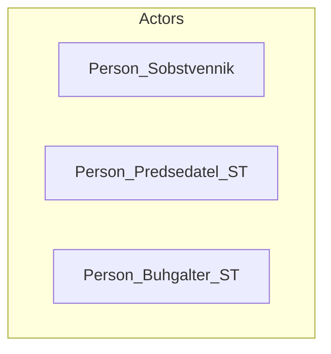
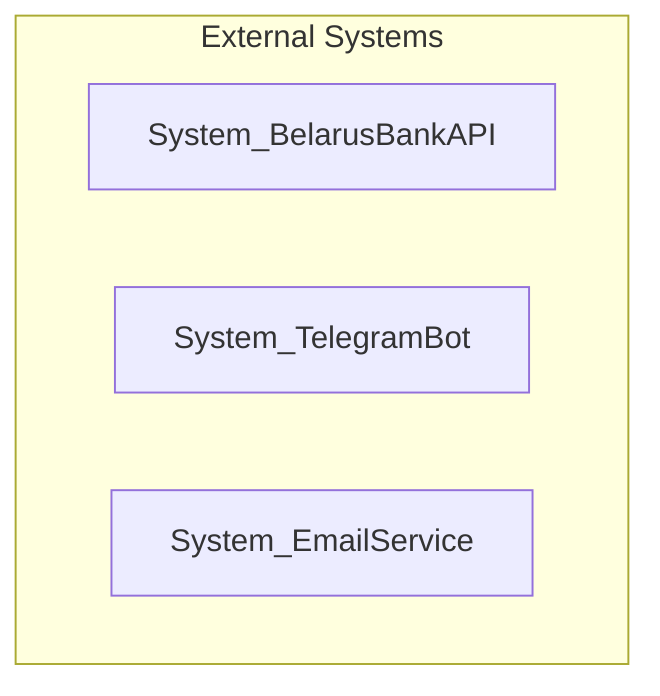
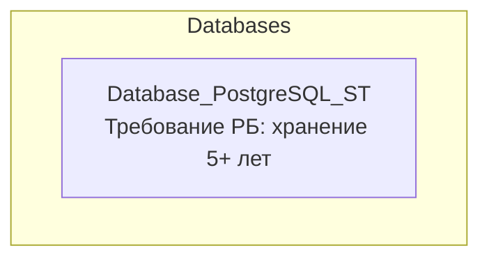
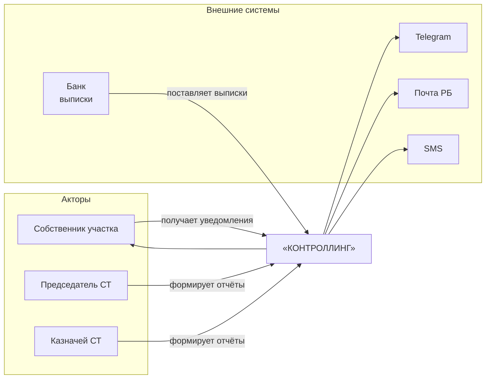
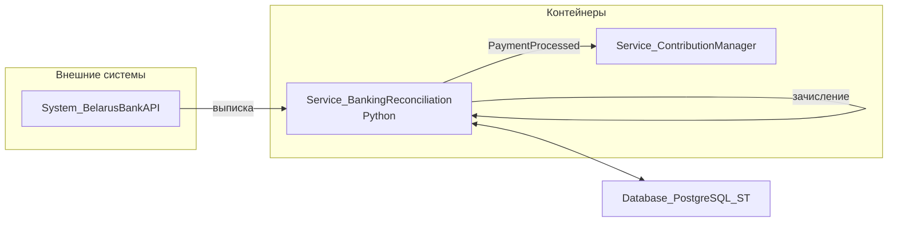

# Диаграммы архитектуры КОНТРОЛЛИНГ

На GitHub диаграммы ниже рендерятся нативно (Mermaid).

## 1. Акторы (actors)

## 2. Внешние системы (external_systems)

## 3. Базы данных (databases)

## 4. System Context L1 (system-context-l1)

## 5. Container L2 — Банковские выписки (container-diagram)

