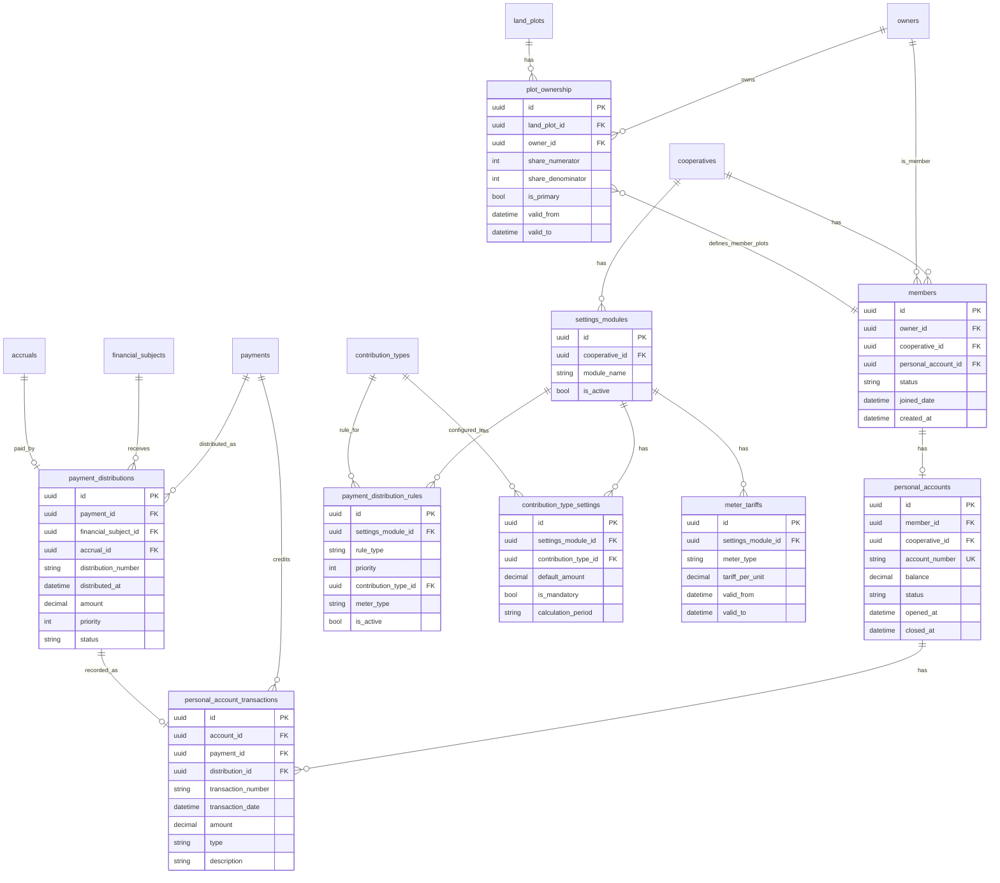

# ER-диаграмма: модуль Payment Distribution

**Назначение:** Модель данных модуля распределения платежей (Member, лицевые счета, распределение по долгам).
**Связано:** [ADR 0003](../architecture/adr/0003-payment-distribution-model.md), [payment-distribution-continue.md](../tasks/payment-distribution-continue.md).

## Сущности модуля

| Таблица | Описание |
|--------|----------|
| `members` | Член СТ (связь Owner ↔ Cooperative) — тонкая техническая сущность |
| `personal_accounts` | Лицевой счёт члена |
| `personal_account_transactions` | Операции по лицевому счёту (зачисление, распределение) |
| `payment_distributions` | Распределение платежа по виду долга (Payment → FinancialSubject) |
| `settings_modules` | Модуль настроек СТ (приоритеты, тарифы) |
| `payment_distribution_rules` | Правила приоритета распределения |
| `contribution_type_settings` | Настройки видов взносов по модулю |
| `meter_tariffs` | Тарифы по типам счётчиков |

## Связь с PlotOwnership

**Важно:** Связь Member ↔ LandPlot осуществляется **не через отдельную таблицу**, а через существующую `plot_ownership`:
- `PlotOwnership.is_primary = true` означает, что владелец является членом СТ для данного участка
- Member создаётся автоматически при первом `PlotOwnership.is_primary = true` для Owner в Cooperative
- Участки члена получаются через запрос: `PlotOwnership WHERE owner_id = :member_owner_id AND is_primary = true`

## Диаграмма (Mermaid ER)

## Связи с другими модулями

- **cooperative_core:** `cooperatives` — Member, PersonalAccount, SettingsModule привязаны к СТ.
- **land_management:** `owners`, `land_plots`, `plot_ownership` — Member связан с Owner через PlotOwnership.
- **financial_core:** `financial_subjects` — PaymentDistribution зачисляет сумму на FinancialSubject.
- **payments:** `payments` — платёж зачисляется на лицевой счёт и распределяется через PaymentDistribution.
- **accruals:** `contribution_types`, `accruals` — правила и настройки видов взносов, начисления оплачиваются распределением.
