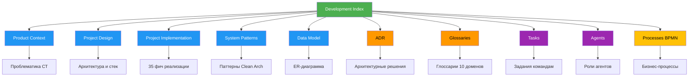

# Development Index — Индекс разработки

**PRIMARY WORK PLAN — Single entry point. Everything starts here. Read this first.**

**Статус:** Актуальный  
**Последнее обновление:** 2026-03-05  
**Владелец:** Lead Architect  
**Аудитория:** Агенты Cursor, разработчики проекта

---

## 4.1 Назначение

Этот документ — **единая точка входа** для навигации по всей документации проекта КОНТРОЛЛИНГ (система учёта для садоводческих товариществ СТ).

**Что вы найдёте здесь:**

- 🎯 **Топ-5 задач** — что делать прямо сейчас
- 🗺️ **Дорожная карта** — статус всех 35 фич реализации
- 📚 **Архитектура** — модель данных, ADR, глоссарии
- 👥 **Роли агентов** — кто за что отвечает
- 📋 **Задания** — текущие задачи по командам
- 🔧 **Инфраструктура** — сборка, тесты, деплой
- 📁 **Архив** — исходные материалы и история

**Когда использовать:**

| Ситуация | Куда смотреть |
|----------|---------------|
| Начинаю новую задачу | Секция 4.2 (Топ-5) |
| **Где остановились / что делать завтра? (контекст сессии)** | **[`docs/plan/current-focus.md`](plan/current-focus.md)** |
| Хочу понять общую картину | Секция 4.3 (Дорожная карта) |
| **План разработки, целостность, ревью агентов** | **[`docs/plan/development-plan-and-integrity.md`](plan/development-plan-and-integrity.md)** |
| Нужно архитектурное решение | Секция 4.4 (ADR) |
| Не знаю, кто отвечает за задачу | Секция 4.5 (Роли) |
| Требуется контекст по модулю | Секция 4.6 (Архитектура) |

---

## 4.2 Топ-5: что делать прямо сейчас

**Приоритеты на текущий спринт** (обновляется еженедельно):

| # | Задача | Команда | Статус | Ссылка |
|---|--------|---------|--------|--------|
| 1 | **Наполнение глоссариев по доменам** — 7 из 10 доменов не заполнены (cooperative, land, payments, expenses, meters, reporting, administration) | Architecture | 🟡 Low Priority | [`docs/history/PENDING_GAPS.md`](history/PENDING_GAPS.md) |
| 2 | **Frontend: миграция на модульную Clean Architecture** — пост-MVP задача | Frontend | ⚪ Не начато | [`docs/project-implementation.md`](project-implementation.md) |
| 3 | **E2E тесты: расширить покрытие** — критические пользовательские сценарии | QA | 🟡 В работе | [`docs/tasks/e2e-setup.md`](tasks/e2e-setup.md) |
| 4 | **Документация OpenAPI** — пост-MVP | Backend | ⚪ Не начато | пост-MVP |
| 5 | **Docker: верификация e2e прохождения в Docker** — F33 шаги отмечены, требуется e2e тестирование | DevOps | 🟡 В работе | [`DEPLOY.md`](../DEPLOY.md) |

**Легенда:** 🟢 Готово | 🟡 В работе | 🔴 Blocked | ⚪ Не начато

---

## 4.3 Дорожная карта по фичам

**Статус реализации бэкенда:** ✅ **35 из 35 фич завершены** (100%)

Полный план: [`docs/project-implementation.md`](project-implementation.md)

### Сводка по модулям

| Модуль | Фичи | Статус |
|--------|------|--------|
| **Инициализация** | 1–8 | ✅ Завершено |
| **Модели данных** | 2–8 | ✅ Завершено |
| **Pydantic схемы** | 9 | ✅ Завершено |
| **API Authentication** | 10 | ✅ Завершено |
| **API Cooperatives** | 11 | ✅ Завершено |
| **API Owners & LandPlots** | 12–13 | ✅ Завершено |
| **API Financial Subjects** | 14 | ✅ Завершено |
| **API Accruals** | 15 | ✅ Завершено |
| **API Payments** | 16 | ✅ Завершено |
| **API Expenses** | 17 | ✅ Завершено |
| **API Meters** | 18 | ✅ Завершено |
| **API Reporting** | 19 | ✅ Завершено |
| **Seed Database** | 20 | ✅ Завершено |
| **Тесты** | 21–35 | ✅ Завершено |

### Следующий этап: Frontend

| Фаза | Фичи | Описание |
|------|------|----------|
| **Фаза 1** | TBD | Авторизация, личный кабинет, профиль СТ |
| **Фаза 2** | TBD | Управление участками, владельцами |
| **Фаза 3** | TBD | Финансы: начисления, платежи, расходы |
| **Фаза 4** | TBD | Отчётность, дашборды, экспорт |

---

## 4.4 История решений и дыры

### Архитектурные решения (ADR)

Индекс ADR: [`docs/architecture/adr/README.md`](architecture/adr/README.md)

| ADR | Название | Дата | Статус |
|-----|----------|------|--------|
| [0001](architecture/adr/0001-canonical-tech-stack.md) | Канонический стек (FastAPI + Vue 3) | 2026-03-01 | ✅ Принято |

### Устранённые дыры

Полный список: [`docs/history/RESOLVED_GAPS.md`](history/RESOLVED_GAPS.md)

| Дыра | Дата устранения | Команда |
|------|-----------------|---------|
| Источник правды для технологического стека | 2026-03-01 | Architecture |
| Источник правды для размещения ORM-моделей | 2026-03-01 | Backend |
| Границы слоёв: зависимость API от Infrastructure | 2026-03-01 | Backend |
| Роли окружений и политика переменных | 2026-03-01 | DevOps |
| Расположение .env и рабочий каталог | 2026-03-01 | DevOps |
| Каноничность get_db и переопределение в тестах | 2026-03-01 | Backend |
| ADR: индекс и процесс ведения | 2026-03-01 | Architecture |
| Канонический seed и скрипты наполнения | 2026-03-01 | Backend |
| CI и переменные для тестов | 2026-03-01 | DevOps |

### Открытые дыры

| Дыра | Приоритет | Статус | Команда |
|------|-----------|--------|---------|
| Глоссарии по доменам (7 из 10) | Low | 🟡 PARTIALLY RESOLVED | Architecture |

---

## 4.5 Задания по ролям

### Текущие задания

| Задание | Команда | Срок | Статус |
|---------|---------|------|--------|
| [TASK_Architecture_20260301.md](tasks/TASK_Architecture_20260301.md) | Architecture | 2026-03-01 | ✅ Завершено |
| [TASK_Backend_20260301.md](tasks/TASK_Backend_20260301.md) | Backend | 2026-03-01 | ✅ Завершено |
| [TASK_DevOps_20260301.md](tasks/TASK_DevOps_20260301.md) | DevOps | 2026-03-01 | ✅ Завершено |

### Архив заданий

- [`docs/tasks/`](tasks/) — все TASK_* файлы и рабочие документы

### Соответствие ролей и команд

| Роль агента | Команда | Ответственность |
|-------------|---------|-----------------|
| [`backend-developer`](.cursor/rules/agents/backend-developer.mdc) | Backend | API, модели, миграции, тесты |
| [`frontend-developer`](.cursor/rules/agents/frontend-developer.mdc) | Frontend | Vue 3 компоненты, интеграция |
| [`project-orchestrator`](.cursor/rules/agents/project-orchestrator.mdc) | PM | Планирование, координация |
| [`qa-engineer`](.cursor/rules/agents/qa-engineer.mdc) | QA | Тест-кейсы, регрессия |
| [`devops-infra-engineer`](.cursor/rules/agents/devops-infra-engineer.mdc) | DevOps | CI/CD, деплой, мониторинг |
| [`security-engineer`](.cursor/rules/agents/security-engineer.mdc) | Security | Аудит, уязвимости |
| [`ux-ui-designer`](.cursor/rules/agents/ux-ui-designer.mdc) | Design | Прототипы, дизайн-система |

Порядок выполнения: [`agent-team-tasks-order.md`](.cursor/rules/agents/agent-team-tasks-order.mdc)

---

## 4.6 Архитектура и модель данных

### Clean Architecture

```
┌─────────────────────────────────────────┐
│          API Layer (FastAPI)            │  ← modules/*/api/routes.py
├─────────────────────────────────────────┤
│       Application (Use Cases)           │  ← modules/*/application/use_cases.py
├─────────────────────────────────────────┤
│          Domain (Entities)              │  ← modules/*/domain/entities.py
├─────────────────────────────────────────┤
│      Infrastructure (SQLAlchemy)        │  ← modules/*/infrastructure/models.py
└─────────────────────────────────────────┘
```

**Подробности:** [`docs/architecture/system-patterns.md`](architecture/system-patterns.md)

### Модель данных

**Интерактивная схема:** [`docs/data-model/schema-viewer.html`](data-model/schema-viewer.html)

**Минимальный набор сущностей:** [`entities-minimal.md`](data-model/entities-minimal.md)

**Концептуальная модель:** [`conceptual-model-prompt.md`](data-model/conceptual-model-prompt.md)

### Модули бэкенда

| Модуль | Путь | Описание |
|--------|------|----------|
| `cooperative_core` | `backend/app/modules/cooperative_core/` | Управление СТ |
| `land_management` | `backend/app/modules/land_management/` | Участки, владельцы |
| `financial_core` | `backend/app/modules/financial_core/` | Финансовые субъекты |
| `accruals` | `backend/app/modules/accruals/` | Начисления |
| `payments` | `backend/app/modules/payments/` | Платежи |
| `expenses` | `backend/app/modules/expenses/` | Расходы |
| `meters` | `backend/app/modules/meters/` | Приборы учёта |
| `reporting` | `backend/app/modules/reporting/` | Отчёты |
| `administration` | `backend/app/modules/administration/` | Auth, пользователи |

### Домены (L2-диаграммы)

| Домен | Статус | Файл |
|-------|--------|------|
| Bank Statements | ✅ Есть диаграмма | [`domains/bank_statements/container-diagram.mmd`](../domains/bank_statements/container-diagram.mmd) |
| Contributions | ⚪ Пусто | — |
| Meter Readings | ⚪ Пусто | — |
| Notifications | ⚪ Пусто | — |
| Plots | ⚪ Пусто | — |
| Reporting | ⚪ Пусто | — |

**Полный список:** [`domains/`](../domains/)

### Глоссарии по доменам

| Домен | Статус | Файл |
|-------|--------|------|
| Accruals | ✅ Заполнен | [`accruals.md`](architecture/glossary/accruals.md) |
| Contributions | ✅ Заполнен | [`contributions.md`](architecture/glossary/contributions.md) |
| Financial | ✅ Заполнен | [`financial.md`](architecture/glossary/financial.md) |
| Cooperative | ⚪ Ожидает | — |
| Land | ⚪ Ожидает | — |
| Payments | ⚪ Ожидает | — |
| Expenses | ⚪ Ожидает | — |
| Meters | ⚪ Ожидает | — |
| Reporting | ⚪ Ожидает | — |
| Administration | ⚪ Ожидает | — |

**Политика:** [`README.md`](architecture/glossary/README.md)

---

## 4.7 Роли агентов

### Как использовать

1. Откройте нужный файл роли в [`.cursor/rules/agents/`](.cursor/rules/agents/)
2. Используйте промпт как контекст для задачи
3. Следуйте чек-листам и анти-паттернам роли

### Ограниченные пути (Restricted paths)

**Запрещено изменять** всем, кроме Lead Architect:

| Путь | Владелец |
|------|----------|
| `docs/architecture/glossary/` | Lead Architect |

**Полный список:** [`OWNERSHIP.md`](architecture/OWNERSHIP.md)

### Файлы ролей

| Файл | Роль | Когда использовать |
|------|------|--------------------|
| [`backend-developer.mdc`](.cursor/rules/agents/backend-developer.mdc) | Backend-разработчик | API, модели, миграции, бизнес-логика |
| [`frontend-developer.mdc`](.cursor/rules/agents/frontend-developer.mdc) | Frontend-разработчик | Vue 3 компоненты, интеграция с API |
| [`project-orchestrator.mdc`](.cursor/rules/agents/project-orchestrator.mdc) | Оркестратор/PM | Планирование, декомпозиция |
| [`qa-engineer.mdc`](.cursor/rules/agents/qa-engineer.mdc) | QA-инженер | Тест-кейсы, проверка требований |
| [`devops-infra-engineer.mdc`](.cursor/rules/agents/devops-infra-engineer.mdc) | DevOps | CI/CD, деплой, инфраструктура |
| [`security-engineer.mdc`](.cursor/rules/agents/security-engineer.mdc) | Security-инженер | Аудит безопасности |
| [`ux-ui-designer.mdc`](.cursor/rules/agents/ux-ui-designer.mdc) | UX/UI дизайнер | Прототипы, дизайн |
| [`seo-content-specialist.mdc`](.cursor/rules/agents/seo-content-specialist.mdc) | SEO/контент | Контент, SEO (если применимо) |

---

## 4.8 Инфраструктура и качество

### Быстрый старт

```powershell
# Один раз
npm install
cd backend && python -m venv venv
.\venv\Scripts\Activate.ps1
pip install -e ".[dev]"

# Запуск обоих сервисов (из корня)
npm run dev
```

**Доступ:**
- Frontend: http://localhost:5173
- Backend API: http://localhost:8000
- Swagger: http://localhost:8000/docs

### Тесты

```powershell
cd backend
pytest                          # Все тесты
pytest tests/test_health.py     # Health check
```

**Статус:** ✅ 197 тестов проходят (in-memory SQLite)

### Линтинг

```powershell
cd backend
ruff check .
ruff format --check .
```

### Миграции (Alembic)

```powershell
cd backend
alembic revision --autogenerate -m "описание"
alembic upgrade head
```

### Seed Database (тестовые данные)

```powershell
cd backend
python -m app.scripts.seed_db
```

Создаёт: 2 СТ, владельцы, участки, пользователи, начисления, платежи, расходы, счётчики.

### Docker (база и API)

```bash
docker compose up --build -d
```

Поднимаются только **db** и **backend**. Фронтенд запускается отдельно: из корня `npm run dev`, затем открыть http://localhost:5173.

**Доступ:**
- Frontend: http://localhost:5173 (после `npm run dev`)
- Backend: http://localhost:8000

### Переменные окружения

**Политика:** [`docs/architecture/environment-policy.md`](architecture/environment-policy.md)

| Переменная | Описание | Где хранить |
|------------|----------|-------------|
| `DATABASE_URL` | PostgreSQL URI (asyncpg) | `.env` (backend/) |
| `SECRET_KEY` | JWT secret | `.env` (backend/) |
| `ACCESS_TOKEN_EXPIRE_MINUTES` | Время жизни токена | `.env` (backend/) |

---

## 4.9 Архив и исходные материалы

### Исходные материалы

| Файл | Описание |
|------|----------|
| [`source-material/`](source-material/) | Исходное описание предметной области |
| [`БИЗНЕС_ЛОГИКА_И_СТРУКТУРА_БД.md`](source-material/БИЗНЕС_ЛОГИКА_И_СТРУКТУРА_БД.md) | Бизнес-логика СТ |
| [`model-data.txt`](source-material/model-data.txt) | Концептуальная модель данных |

### Архив документов

| Файл | Описание |
|------|----------|
| [`archive/`](archive/) | Устаревшие версии документов |
| [`decomposition.md`](decomposition.md) | Декомпозиция проекта |
| [`one-project-setup.md`](one-project-setup.md) | Настройка одного проекта |
| [`repository-sync-guide.md`](repository-sync-guide.md) | Гайд по синхронизации репозитория |

### BPMN-процессы

| Файл | Описание |
|------|----------|
| [`processes/`](processes/) | BPMN 2.0 диаграммы процессов |
| [`bpmn-viewer.html`](processes/bpmn-viewer.html) | Интерактивный просмотрщик |

### Контекст по фичам

| Файл | Описание |
|------|----------|
| [`context-tree/features/`](context-tree/features/) | Контекст для каждой фичи |
| [`feature-context-plan.md`](feature-context-plan.md) | План контекстов |

---

## 4.10 Правила обновления

### Когда обновлять этот документ

| Событие | Что обновить |
|---------|--------------|
| Новая фича завершена | Секция 4.3 (Дорожная карта) |
| Новый ADR принят | Секция 4.4 (ADR индекс) |
| Дыра устранена | Секция 4.4 (Устранённые дыры) |
| Новое задание создано | Секция 4.5 (Задания) |
| Изменение инфраструктуры | Секция 4.8 (Инфраструктура) |

### Кто обновляет

- **Владелец:** Lead Architect
- **Инициировать:** может любой разработчик через PR
- **Частота:** еженедельно (по пятницам) или по событию

### Чек-лист обновления

- [ ] Проверить актуальность Топ-5 (секция 4.2)
- [ ] Обновить статусы фич (секция 4.3)
- [ ] Добавить новые ADR (секция 4.4)
- [ ] Проверить открытые/закрытые дыры (секция 4.4)
- [ ] Синхронизировать с `docs/project-implementation.md`

---

## 4.11 Диаграмма связей



### Навигация по уровням

| Уровень | Документы | Для кого |
|---------|-----------|----------|
| **Продукт** | [`product-context.md`](product-context.md) | PM, заказчики |
| **Дизайн** | [`project-design.md`](project-design.md), [`system-patterns.md`](architecture/system-patterns.md) | Архитекторы, Tech Lead |
| **Реализация** | [`project-implementation.md`](project-implementation.md) | Разработчики |
| **Данные** | [`data-model/`](data-model/) | Backend, архитекторы |
| **Процессы** | [`processes/`](processes/), [`tasks/`](tasks/) | Все команды |
| **Решения** | [`adr/`](architecture/adr/), [`history/`](history/) | Архитекторы |

---

## 🔗 Быстрые ссылки

| Документ | Путь |
|----------|------|
| **Главное правило проекта** | [`QWEN.md`](../QWEN.md) |
| **Технический стек** | [`AGENTS.md`](../AGENTS.md) |
| **План разработки и целостность** | [`docs/plan/development-plan-and-integrity.md`](plan/development-plan-and-integrity.md) |
| **Дизайн системы** | [`docs/project-design.md`](project-design.md) |
| **План реализации** | [`docs/project-implementation.md`](project-implementation.md) |
| **Модель данных** | [`docs/data-model/schema-viewer.html`](data-model/schema-viewer.html) |
| **ADR индекс** | [`docs/architecture/adr/README.md`](architecture/adr/README.md) |
| **Глоссарии** | [`docs/architecture/glossary/README.md`](architecture/glossary/README.md) |
| **BPMN процессы** | [`docs/processes/bpmn-viewer.html`](processes/bpmn-viewer.html) |
| **Текущий фокус (где остановились, что делать завтра)** | [`docs/plan/current-focus.md`](plan/current-focus.md) |
| **Спецификация Ledger-ready (backend)** | [`docs/tasks/IMPLEMENTATION_SPEC_LEDGER_READY.md`](tasks/IMPLEMENTATION_SPEC_LEDGER_READY.md) |
| **Анализ финансовой архитектуры** | [`docs/plan/financial-architecture-analysis.md`](plan/financial-architecture-analysis.md) |
| **Вывод: единая точка входа и workflow веток** | [`docs/plan/CONCLUSION-SINGLE-ENTRY-AND-BRANCH-WORKFLOW.md`](plan/CONCLUSION-SINGLE-ENTRY-AND-BRANCH-WORKFLOW.md) |

---

## 4.12 Целостность системы

**Перед закрытием задачи:**

1. **Верификация:** тесты + логи («утвердил бы staff engineer?»)
2. **Чек-лист:** [`docs/tasks/workflow-orchestration.md`](tasks/workflow-orchestration.md) (раздел 1.7 Pre-Commit Checklist)
3. **При архитектурных изменениях:** ревью `project-orchestrator` (вызвать вручную)

**Документы целостности:**

| Документ | Назначение |
|----------|------------|
| [`OWNERSHIP.md`](architecture/OWNERSHIP.md) | Кто что может менять (ограниченные пути) |
| [`ADR README.md`](architecture/adr/README.md) | Архитектурные решения |
| [`system-patterns.md`](architecture/system-patterns.md) | Границы архитектуры, Clean Architecture |
| [`development-plan-and-integrity.md`](plan/development-plan-and-integrity.md) | Как не «метаться», процесс разработки |

**Правило:** Задачи, затрагивающие ADR, глоссарии, границы модулей или общие контракты API, перед закрытием проходят ревью `project-orchestrator`.

---

*Последнее обновление: 2026-03-05*
