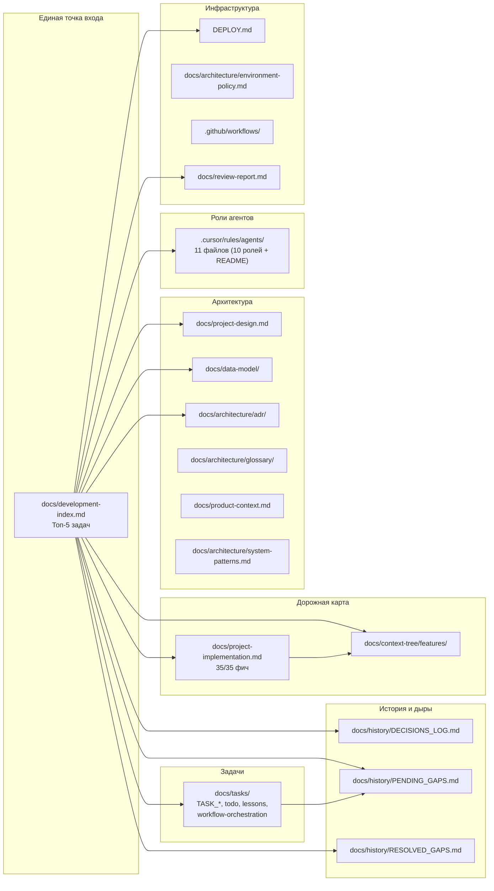

# План: единый индекс разработки и дорожная карта (v2)

## Цель

Устранить размытие контекста и разночтения при работе разных агентов. Один индексный документ (`docs/development-index.md`) указывает, где что лежит, содержит приоритизированный «Топ-5 задач» и правила обновления. Дорожная карта по фичам остаётся в `project-implementation.md`, но «стержнем» для входа в контекст становится индекс.

## Принятые решения (обсуждение 2026-03-02)


| #   | Вопрос                                       | Решение                                                                                                            |
| --- | -------------------------------------------- | ------------------------------------------------------------------------------------------------------------------ |
| 1   | Две системы задач (`tasks/` и `docs/tasks/`) | Объединить в `docs/tasks/`, корневую `tasks/` удалить                                                              |
| 2   | Источник «что дальше»                        | Индекс содержит «Топ-5 задач» → ссылки на `project-implementation.md` (backlog фич) и `PENDING_GAPS` (backlog дыр) |
| 3   | `.memory-bank/`                              | Перенести полезное (`productContext.md`, `systemPatterns.md`) в `docs/`, остальное удалить                         |
| 4   | `logs/` (12 файлов)                          | Удалить — история в git, решения в `DECISIONS_LOG`                                                                 |
| 5   | Роли агентов (`docs/agents/`)                | Перенести в `.cursor/rules/agents/` для автоматического подхвата Cursor по globs                                   |
| 6   | Критические расхождения                      | Исправить первым шагом (этап 1) до создания индекса                                                                |
| 7   | Правило «читай индекс»                       | Создать `.cursor/rules/development-index-rule.mdc` с `alwaysApply: true`                                           |


## Текущее состояние (аудит 2026-03-02)

### Критические расхождения факт vs. документация

1. **AGENTS.md** говорит `frontend/` is empty — реально 15 views, 6 stores, Playwright e2e
2. **F33** (Docker) — шаги `[ ]` в `project-implementation.md`, но фича выполнена (Dockerfiles, docker-compose, версионный `F33-v1-2026-02-24.md`)
3. **PENDING_GAPS** — все 10 дыр PENDING, хотя 9 закрыты выполненными TASK-файлами, 1 частично
4. **RESOLVED_GAPS** — пуст (ни одна запись не добавлена)
5. `**.memory-bank/techContext.md**` — Python 3.14 (должно быть 3.11+)
6. `**.memory-bank/` метрики** — 192 теста (фактически 197), CI/CD 0% (workflows существуют), E2E 0% (Playwright настроен)

### Матрица: 10 дыр → статус


| #   | Дыра                                 | Приоритет | Задача              | Дыра закрыта?                                        |
| --- | ------------------------------------ | --------- | ------------------- | ---------------------------------------------------- |
| 1   | Источник правды для стека            | Critical  | ID-Architecture-001 | **ДА**                                               |
| 2   | Источник правды для ORM-моделей      | Critical  | ID-Backend-001      | **ДА**                                               |
| 3   | Границы слоёв: API от Infrastructure | Critical  | ID-Backend-002      | **ДА**                                               |
| 4   | Роли окружений и политика переменных | High      | ID-DevOps-001       | **ДА**                                               |
| 5   | Расположение .env и CWD              | High      | ID-DevOps-002       | **ДА**                                               |
| 6   | Каноничность get_db                  | High      | ID-Backend-003      | **ДА**                                               |
| 7   | ADR: индекс и процесс                | High      | ID-Architecture-002 | **ДА**                                               |
| 8   | Глоссарии по доменам                 | Medium    | ID-Architecture-003 | **ЧАСТИЧНО** — политика есть, 3/10 доменов заполнены |
| 9   | Канонический seed                    | Medium    | ID-Backend-004      | **ДА**                                               |
| 10  | CI и переменные для тестов           | Medium    | ID-DevOps-003       | **ДА**                                               |


### Источники контекста, не покрытые старым планом

- `tasks/` (корень) — `todo.md`, `lessons.md`, `workflow-orchestration.md`, `e2e-setup.md`
- `docs/review-report.md` — отчёт ревью (197 тестов, ruff фиксы)
- `docs/one-project-setup.md` — настройка единого проекта
- `docs/data-model/` — `entities-minimal.md`, `schema-viewer.html`, `conceptual-model-prompt.md`
- `docs/agents/` — 11 файлов ролей агентов
- `docs/archive/`, `docs/source-material/` — ~140 файлов истории и бизнес-логики
- `.cursor/rules/` — 12 правил, контролирующих поведение агентов
- `DEPLOY.md` — инструкция деплоя
- Frontend — полноценная кодовая база (15 views, 6 stores, Playwright)

### Иерархия источников «что дальше» (после внедрения)

```
docs/development-index.md       → «Топ-5: что делать прямо сейчас» (стержень)
  ├─ docs/project-implementation.md  → полный backlog фич
  ├─ docs/history/PENDING_GAPS.md    → полный backlog дыр
  ├─ docs/tasks/todo.md              → scratch-pad на текущую задачу (внутрисессионный)
  └─ (activeContext — удалён; нарратив сессии не нужен)
```

Простое правило для агента: **открой `development-index.md` → смотри «Топ-5» → бери задачу → работай.**

---

## Этап 1: Исправить критические расхождения

Сначала привести факты в порядок, чтобы индекс ссылался на корректные документы.

### 1.1 AGENTS.md — убрать «frontend/ is empty»

Заменить `Vue 3 + TypeScript + Vite + Pinia (not yet scaffolded — frontend/ is empty)` на актуальное описание: frontend развёрнут, 15 views, 6 Pinia stores, Playwright e2e, Dockerfile + nginx.

### 1.2 project-implementation.md — отметить шаги F33

Все шаги Фичи 33 (Docker) отметить `[x]` — Dockerfiles, docker-compose, .dockerignore реально созданы и работают (подтверждено `F33-v1-2026-02-24.md`). Итог: **все 35 фич выполнены.**

### 1.3 docs/review-report.md — зафиксировать как артефакт

Убедиться, что `docs/review-report.md` (197 тестов, ruff clean) актуален и корректен. Он войдёт в индекс как артефакт качества.

---

## Этап 2: Синхронизировать PENDING_GAPS и RESOLVED_GAPS

### 2.1 Закрыть 9 полностью решённых дыр

Для каждой из 9 закрытых дыр (## 1–7, 9, 10 из матрицы выше):

- Добавить запись в `RESOLVED_GAPS.md` по шаблону (название, дата устранения 2026-03-01, команда, файл-задание, результат, верификация)
- Удалить строку из таблицы `PENDING_GAPS.md`

### 2.2 Обновить дыру «Глоссарии по доменам»

Дыра #8 — частично закрыта. В `PENDING_GAPS.md` обновить:

- Статус: PARTIALLY RESOLVED
- Приоритет: понизить до Low
- Описание: политика зафиксирована (DEC-003, `glossary/README.md`), заполнены 3 из 10 доменов (accruals, contributions, financial); наполнение остальных — отдельная задача

### 2.3 Проверить корректность

- Все ссылки `RESOLVED_GAPS → TASK_*` корректны
- В `PENDING_GAPS` осталась только 1 дыра (глоссарии) или записано «открытых критических дыр нет»

---

## Этап 3: Консолидация — убрать дублирование и переместить файлы

### 3.1 `.memory-bank/` → перенести полезное, удалить остальное


| Файл                          | Действие  | Куда                                                                             |
| ----------------------------- | --------- | -------------------------------------------------------------------------------- |
| `productContext.md`           | Перенести | `docs/product-context.md` — уникальная информация о проблемах СТ, акторах, целях |
| `systemPatterns.md`           | Перенести | `docs/architecture/system-patterns.md` — паттерны Clean Architecture, DI, Events |
| `projectbrief.md`             | Удалить   | Дублирует README.md и AGENTS.md                                                  |
| `techContext.md`              | Удалить   | Дублирует AGENTS.md (и содержит ошибку Python 3.14)                              |
| `activeContext.md`            | Удалить   | Устарел, роль заменяет `development-index.md`                                    |
| `progress.md`                 | Удалить   | Устарел, метрики переедут в индекс                                               |
| `SETUP_COMPLETE.md`           | Удалить   | Одноразовая заметка                                                              |
| `memory_bank_instructions.md` | Удалить   | Инструкции для несуществующего MCP workflow                                      |


После переноса удалить папку `.memory-bank/`.

> **Дополнительно (3.1.1):** после переноса обновить внутренние ссылки в `docs/product-context.md`: ссылки на `projectbrief.md` удалить (файл удалён), `systemPatterns.md` → `docs/architecture/system-patterns.md`, `techContext.md` → `AGENTS.md` и т.д.

### 3.2 `tasks/` (корневая) → объединить в `docs/tasks/`


| Файл                              | Действие                                           |
| --------------------------------- | -------------------------------------------------- |
| `tasks/workflow-orchestration.md` | Перенести в `docs/tasks/workflow-orchestration.md` |
| `tasks/todo.md`                   | Перенести в `docs/tasks/todo.md`                   |
| `tasks/lessons.md`                | Перенести в `docs/tasks/lessons.md`                |
| `tasks/e2e-setup.md`              | Перенести в `docs/tasks/e2e-setup.md`              |


Обновить `.cursor/rules/plan/workflow-orchestration.mdc` — изменить пути с `tasks/` на `docs/tasks/`, а также обновить frontmatter: `globs: tasks/**` → `globs: docs/tasks/**`.

После переноса удалить папку `tasks/`.

### 3.3 `docs/agents/` → перенести в `.cursor/rules/agents/`

Перенести все 11 файлов из `docs/agents/` в `.cursor/rules/agents/`:

- `backend-developer.md` → `.cursor/rules/agents/backend-developer.mdc`
- `frontend-developer.md` → `.cursor/rules/agents/frontend-developer.mdc`
- `qa-engineer.md` → `.cursor/rules/agents/qa-engineer.mdc`
- `devops-infra-engineer.md` → `.cursor/rules/agents/devops-infra-engineer.mdc`
- `security-engineer.md` → `.cursor/rules/agents/security-engineer.mdc`
- `ux-ui-designer.md` → `.cursor/rules/agents/ux-ui-designer.mdc`
- `project-orchestrator.md` → `.cursor/rules/agents/project-orchestrator.mdc`
- `seo-content-specialist.md` → `.cursor/rules/agents/seo-content-specialist.mdc`
- `agent-team-tasks-order.md` → `.cursor/rules/agents/agent-team-tasks-order.mdc`
- `agent-file-lists.md` → `.cursor/rules/agents/agent-file-lists.mdc`
- `README.md` → `.cursor/rules/agents/README.md`

**Стратегия globs:** не использовать широкие glob-паттерны (например, `backend/**`) — они создают шум и непредсказуемый контекст. Предпочтительная стратегия: `alwaysApply: false` без globs (только ручной вызов через `@`). Допустимо: очень узкий glob, если роль однозначно привязана к конкретной папке. Выбор стратегии фиксировать в frontmatter каждого файла.

После переноса удалить `docs/agents/`.

### 3.5 `domains/` → инвентаризация

Просмотреть содержимое папки `domains/` (L2-диаграммы по доменам): проверить, какие домены покрыты, нет ли устаревших файлов. Результат отразить в секции 4.6 индекса — добавить ссылку на `domains/` со списком актуальных доменов.

---

### 3.4 `logs/` → удалить

> **3.12.0 (перед удалением):** бегло просмотреть `logs/` на предмет решений, не покрытых `DECISIONS_LOG`; критичные записи перенести в `DECISIONS_LOG.md` или `docs/archive/` перед удалением.

Удалить все 12 файлов в `logs/` и папку. Ключевые решения из логов (Django→FastAPI, 1C-детур, BPMN) уже зафиксированы в `DECISIONS_LOG.md` и `docs/archive/`. История в git.

---

## Этап 4: Создать единый индексный документ

**Файл:** `docs/development-index.md`

### 4.1 Секция «Назначение»

Единственная точка входа для агентов и разработчиков: всё про историю, план разработки и текущий статус — здесь.

### 4.2 Секция «Топ-5: что делать прямо сейчас»

Приоритизированный список из 5 ближайших задач с типом (фича / дыра / инфраструктура) и ссылкой на источник. Обновляется при закрытии задачи.

Начальное заполнение (по состоянию на 2026-03-02, все 35 фич выполнены):

1. Наполнение глоссариев по доменам (7 из 10 не заполнены) → `PENDING_GAPS`
2. Frontend: миграция на модульную Clean Architecture → `project-implementation` (пост-MVP)
3. E2E тесты: расширить покрытие → `docs/tasks/e2e-setup.md`
4. Документация OpenAPI → пост-MVP
5. Docker: F33 шаги отмечены, верифицировать e2e прохождение в Docker

### 4.3 Секция «Дорожная карта по фичам»

- Канонический источник: [docs/project-implementation.md](docs/project-implementation.md)
- Статус: **35/35 фич выполнены** (F01–F35 ✅)
- Процесс выполнения: [docs/context-tree/feature-workflow-prompt.md](docs/context-tree/feature-workflow-prompt.md)
- Пакеты контекста: [docs/context-tree/features/](docs/context-tree/features/) — 35 базовых + 35 версионных файлов

### 4.4 Секция «История решений и дыры»

- [docs/history/DECISIONS_LOG.md](docs/history/DECISIONS_LOG.md) — 3 принятых решения (DEC-001–DEC-003)
- [docs/history/PENDING_GAPS.md](docs/history/PENDING_GAPS.md) — открытые дыры (после этапа 2: 1 частично открытая)
- [docs/history/RESOLVED_GAPS.md](docs/history/RESOLVED_GAPS.md) — 9 закрытых дыр
- [docs/history/ANALYSIS_LOG.md](docs/history/ANALYSIS_LOG.md) — лог анализов
- ADR: [docs/architecture/adr/](docs/architecture/adr/) — индекс и процесс

### 4.5 Секция «Задания по ролям»

Таблица файлов `docs/tasks/`:


| Файл                          | Цель                           | Статус    | Дата       |
| ----------------------------- | ------------------------------ | --------- | ---------- |
| TASK_Backend_20260301.md      | ORM-модели, deps, get_db, seed | Выполнено | 2026-03-01 |
| TASK_Architecture_20260301.md | Стек, ADR, глоссарии           | Выполнено | 2026-03-01 |
| TASK_DevOps_20260301.md       | Environment policy, .env, CI   | Выполнено | 2026-03-01 |


Плюс ссылки на `docs/tasks/workflow-orchestration.md`, `docs/tasks/todo.md`, `docs/tasks/lessons.md` с описанием назначения каждого.

### 4.6 Секция «Архитектура и модель данных»

- [docs/project-design.md](docs/project-design.md) — дизайн системы
- [docs/data-model/](docs/data-model/) — модель данных, schema-viewer
- [docs/architecture/](docs/architecture/) — ADR, глоссарии, environment-policy, OWNERSHIP
- [docs/product-context.md](docs/product-context.md) — контекст продукта (из memory-bank)
- [docs/architecture/system-patterns.md](docs/architecture/system-patterns.md) — паттерны (из memory-bank)
- [docs/processes/](docs/processes/) — BPMN-процессы
- [domains/](domains/) — L2-диаграммы доменов (содержимое проверяется в ходе шага 3.5)

### 4.7 Секция «Роли агентов»

- [.cursor/rules/agents/](/.cursor/rules/agents/) — 11 файлов (10 ролей + README)
- Порядок работы команд: `agent-team-tasks-order.mdc`
- Списки файлов по ролям: `agent-file-lists.mdc`

### 4.8 Секция «Инфраструктура и качество»

- [DEPLOY.md](DEPLOY.md) — Docker Compose деплой
- [docs/architecture/environment-policy.md](docs/architecture/environment-policy.md) — окружения, переменные
- [docs/one-project-setup.md](docs/one-project-setup.md) — настройка проекта
- [docs/review-report.md](docs/review-report.md) — отчёт ревью (197 тестов, 0 ошибок ruff)
- CI: `.github/workflows/backend-tests.yml`, `frontend-tests.yml`

### 4.9 Секция «Архив и исходные материалы»

- [docs/archive/](docs/archive/) — старые версии (v0-python, v1-1c)
- [docs/source-material/](docs/source-material/) — бизнес-логика, примеры ИнфоБухгалтер

### 4.10 Секция «Правила обновления»

- Закрыта задача `docs/tasks/TASK_*` → обновить `PENDING_GAPS` (удалить/пометить) и добавить в `RESOLVED_GAPS`
- Выполнена фича → обновить `project-implementation.md` (все шаги `[x]`) и создать `Fxx-vN-date` в `context-tree/features`
- Новое архитектурное решение → запись в `DECISIONS_LOG` и ADR в `docs/architecture/adr/`
- Обновление «Топ-5» — при закрытии задачи из списка; при расхождении приоритет у `project-implementation` для фич
- **При конфликте**: `docs/` и `AGENTS.md` > `.cursor/rules/` > всё остальное

---

## Этап 5: Обновить AGENTS.md и README

### 5.1 AGENTS.md

- Добавить в начало (или в раздел Documentation): единая точка входа — `docs/development-index.md`
- Убрать «frontend/ is empty» (этап 1.1)
- Добавить ссылку на `.cursor/rules/agents/` (вместо `docs/agents/`)
- Обновить ссылки, если пути изменились (tasks/, memory-bank)

### 5.2 README.md

- В разделе «Документация» добавить первым пунктом: [Индекс разработки](docs/development-index.md) — единая точка входа
- Остальные ссылки оставить (Дизайн, План реализации, Модель данных, Окружения)

---

## Этап 6: Создать обязательное правило «читай индекс»

**Файл:** `.cursor/rules/development-index-rule.mdc`

```yaml
---
description: "Единая точка входа: перед работой над планом, фичей или архитектурой — прочитай docs/development-index.md"
alwaysApply: true
---
```

Содержание:

- Перед работой над планом разработки, фичей или архитектурной задачей — прочитать `docs/development-index.md`
- Источник «что дальше» — секция «Топ-5» в индексе
- При закрытии задачи из `docs/tasks/` — обновить `PENDING_GAPS/RESOLVED_GAPS`
- При выполнении фичи — `feature-workflow-prompt.md` → `project-implementation.md` → `context-tree/features`
- При конфликте данных — приоритет у `docs/` и `AGENTS.md`

---

## Диаграмма связей (после внедрения v2)




---

## Чеклист выполнения

### Этап 1: Исправить критические расхождения

- **1.1** AGENTS.md — убрать «frontend/ is empty», добавить актуальное описание frontend
- **1.2** project-implementation.md — отметить все шаги F33 `[x]`
- **1.3** docs/review-report.md — проверить актуальность (197 тестов)

### Этап 2: Синхронизация PENDING_GAPS и RESOLVED_GAPS

- **2.1** Добавить 9 записей в RESOLVED_GAPS.md (дыры #1–7, #9, #10)
- **2.2** Обновить PENDING_GAPS.md: удалить 9 закрытых дыр, обновить дыру #8 (глоссарии — PARTIALLY RESOLVED, Low)
- **2.3** Проверить все ссылки RESOLVED_GAPS → TASK_* корректны

### Этап 3: Консолидация — перемещение и удаление

- **3.1** Перенести `.memory-bank/productContext.md` → `docs/product-context.md`
- **3.2** Перенести `.memory-bank/systemPatterns.md` → `docs/architecture/system-patterns.md`
- **3.3** Удалить остальные файлы `.memory-bank/` и папку
- **3.4** Перенести `tasks/workflow-orchestration.md` → `docs/tasks/workflow-orchestration.md`
- **3.5** Перенести `tasks/todo.md` → `docs/tasks/todo.md`
- **3.6** Перенести `tasks/lessons.md` → `docs/tasks/lessons.md`
- **3.7** Перенести `tasks/e2e-setup.md` → `docs/tasks/e2e-setup.md`
- **3.8** Удалить корневую папку `tasks/`
- **3.9** Обновить `.cursor/rules/plan/workflow-orchestration.mdc` — пути `tasks/` → `docs/tasks/`; также обновить frontmatter `globs: tasks/**` → `globs: docs/tasks/**`
- **3.9.1** Обновить ссылку `tasks/e2e-setup.md` → `docs/tasks/e2e-setup.md` в `docs/review-report.md`
- **3.10** Перенести `docs/agents/` (11 файлов) → `.cursor/rules/agents/` (как .mdc без широких globs)
- **3.11** Удалить `docs/agents/`
- **3.12.0** Просмотреть `logs/` на предмет решений, не покрытых `DECISIONS_LOG`; критичные перенести в `DECISIONS_LOG` или `docs/archive/`
- **3.12** Удалить `logs/` (12 файлов) и папку
- **3.13** Инвентаризация `domains/`: проверить содержимое, зафиксировать список актуальных доменов для секции 4.6 индекса

### Этап 4: Создать индексный документ

- **4.1** Создать `docs/development-index.md`
- **4.2** Написать секцию «Назначение»
- **4.3** Написать секцию «Топ-5: что делать прямо сейчас» (начальное заполнение) *(выполнять только после завершения Этапа 1)*
- **4.4** Написать секцию «Дорожная карта по фичам» (35/35, ссылки)
- **4.5** Написать секцию «История решений и дыры» (ссылки на docs/history)
- **4.6** Написать секцию «Задания по ролям» (таблица docs/tasks)
- **4.7** Написать секцию «Архитектура и модель данных» (ссылки)
- **4.8** Написать секцию «Роли агентов» (ссылка на .cursor/rules/agents/)
- **4.9** Написать секцию «Инфраструктура и качество» (DEPLOY, CI, review-report)
- **4.10** Написать секцию «Архив и исходные материалы»
- **4.11** Написать секцию «Правила обновления»

### Этап 5: Обновить AGENTS.md и README

- **5.1** AGENTS.md — добавить ссылку на `development-index.md` как единую точку входа
- **5.2** AGENTS.md — обновить ссылки (`.cursor/rules/agents/` вместо `docs/agents/`, `docs/tasks/` вместо `tasks/`)
- **5.3** README.md — добавить первым пунктом в «Документация» ссылку на индекс
- **5.4** AGENTS.md — обновить все ссылки на перемещённые файлы (`tasks/` → `docs/tasks/`, `docs/agents/` → `.cursor/rules/agents/`, `.memory-bank/` — удалена)

### Этап 6: Правило для агентов

- **6.1** Создать `.cursor/rules/development-index-rule.mdc` с `alwaysApply: true`
- **6.2** Проверить, что правило подхватывается Cursor

---

## Итог (после выполнения всех этапов)

1. **Один документ** (`docs/development-index.md`) — стержень: Топ-5 задач, карта всех источников, правила обновления
2. **Нет дублирования**: `.memory-bank/` удалён, `tasks/` объединены, `logs/` удалены
3. **Нет расхождений**: AGENTS.md, project-implementation.md, PENDING_GAPS — синхронизированы с фактом
4. **Роли агентов** в `.cursor/rules/agents/` — без широких globs; вызов вручную через `@` или узкий glob
5. **Правило** `development-index-rule.mdc` с `alwaysApply: true` — агент **всегда** видит напоминание про индекс
6. **Иерархия «что дальше»**: индекс (Топ-5) → project-implementation (фичи) → PENDING_GAPS (дыры) → docs/tasks/todo.md (сессия)
7. **35/35 фич выполнены**, 9/10 дыр закрыты, 1 частично (глоссарии — Low)
