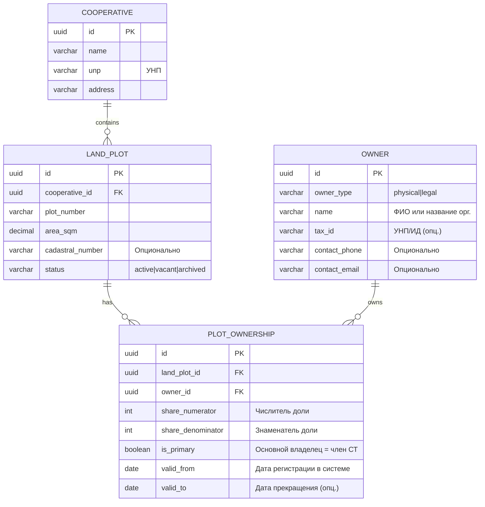
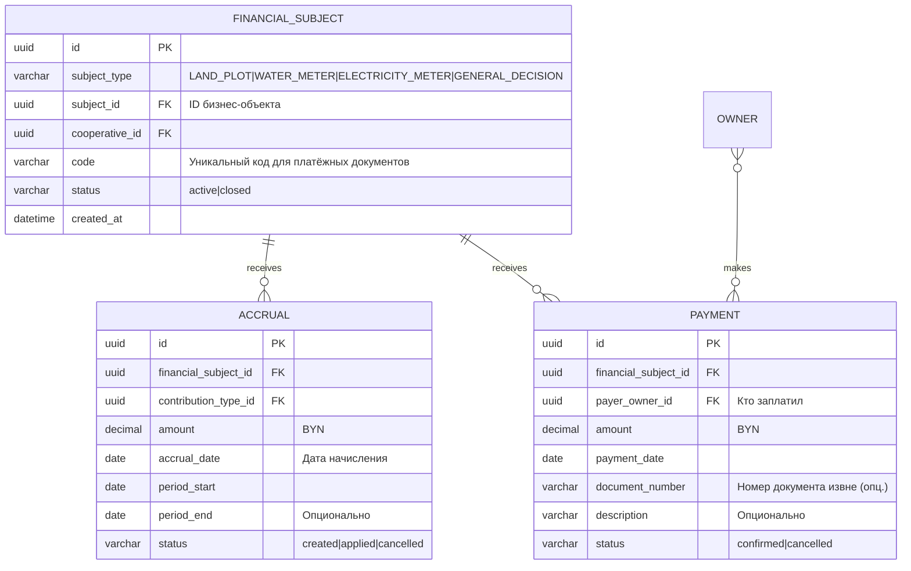
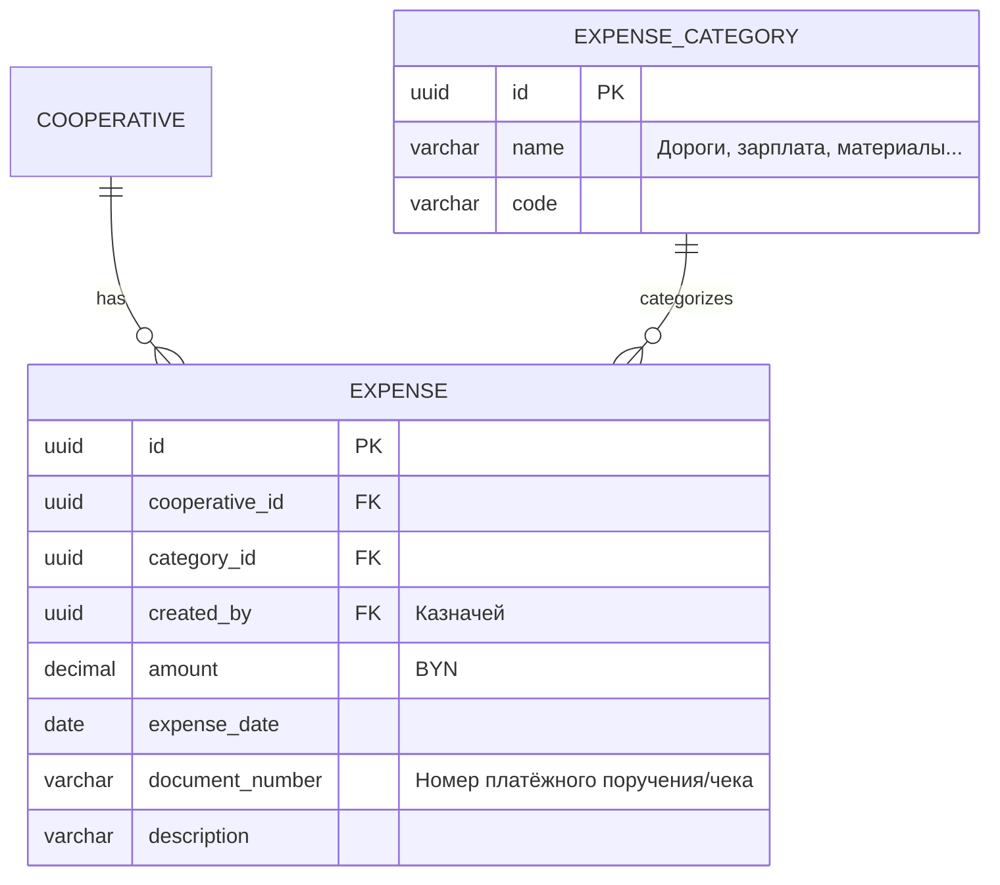
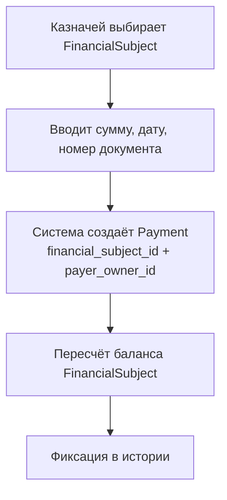
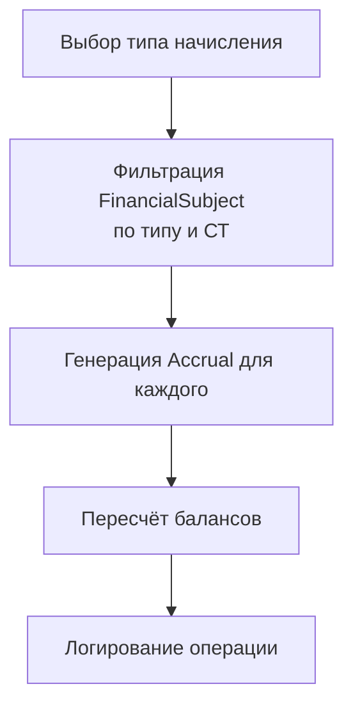
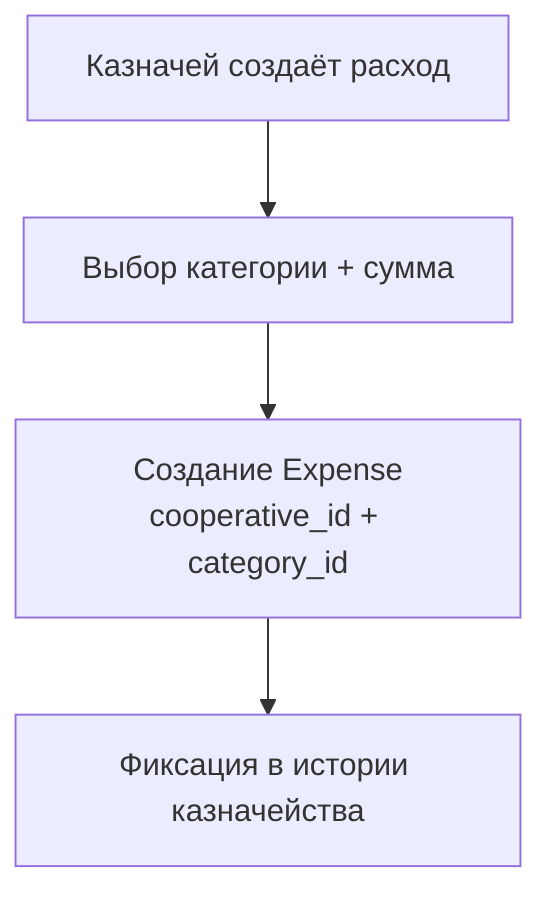

# Дизайн проекта Controlling (v1)

Система учёта хозяйственной деятельности **садоводческих товариществ (СТ)** Республики Беларусь. Предназначена для автоматизации финансовых операций: начисление взносов, учёт платежей, контроль задолженностей, управление участками и приборами учёта.

В проекте используется только аббревиатура **СТ** (Садоводческое Товарищество). Учёт: участки, собственники, начисления, оплаты, приборы учёта, пени, платёжные документы, отчётность. Исходное описание и блоки — в `docs/source-material/БИЗНЕС_ЛОГИКА_И_СТРУКТУРА_БД.md`; концептуальная модель — также в `docs/source-material/model-data.txt`. При переносе в проект терминологию СНТ из исходников заменяем на СТ. Работа по модели ведётся и в `docs/project-design.md`, и в `docs/data-model/`.

---

## 1. Цели системы (v1)

1. **Учёт начислений** — расчёт и хранение начислений по видам взносов и услуг (через FinancialSubject).
2. **Контроль оплат и задолженностей** — регистрация платежей и анализ долгов в реальном времени.
3. **Управление участками и владельцами** — ведение актуального состояния участков с поддержкой множественных владельцев.
4. **Учёт приборов учёта** — хранение показаний и истории счётчиков.
5. **Учёт расходов товарищества** — ремонт, зарплаты, материалы (отдельный финансовый поток).
6. **Финансовая аналитика и отчётность** — внутренние управленческие отчёты (должники, движение средств).
7. **История операций и аудит** — прослеживаемость изменений критичных сущностей.
8. **Администрирование СТ** — управление настройками товариществ.

---

## 2. Технологический стек

| Слой | Технология | Комментарий |
|------|------------|-------------|
| Бэкенд | Python 3.11+, FastAPI | REST API, бизнес-логика |
| База данных | PostgreSQL 15+ | Хранение данных, транзакции (asyncpg) |
| Фронтенд | Vue 3 + TypeScript + Vite + Pinia (SPA) | Отдельное приложение, взаимодействие через REST |
| Аутентификация | JWT + bcrypt | Логин/пароль, роли (python-jose, passlib) |
| Историзация / аудит | TBD | Изменения критичных сущностей (PlotOwnership, Accrual, Payment, Expense) фиксируются; конкретный механизм — текущее решение или в перспективе |

**Архитектура:**
- Фронт и бэкенд **разделены**: отдельное Vue 3 приложение и FastAPI как API.
- Взаимодействие по **REST API** (FastAPI — единственный backend на первом этапе).
- Монолитный бэкенд с чёткими модульными границами (Clean Architecture / DDD по модулям в `backend/app/modules/`).
- Next.js / SSR на старте не используем; при необходимости добавим позже (SEO).
- Идея «всё отдельно» заложена в расчёт на возможное развитие в сторону более модульной/микросервисной архитектуры позже.
- Микросервисы и Docker — в перспективе.

**Примечание:** разделы «Технологический стек», «Микросервисы», «CQRS» и т.п. из исходного материала (`docs/source-material/`) не применяются — принят стек выше.

---

## 3. Развёртывание

- **Среда:** VPS в облаке.
- **Контейнеризация:** Docker — в планах (дальняя перспектива).
- Детализацию развёртывания сейчас не делаем.

---

## 4. Ролевая модель и безопасность

### 4.1. Роли входа

**Роли** учитываются только для входа в систему и доступа к функциям (кто что может делать). Должности в СТ (председатель, бухгалтер и т.д.) в модели данных пока не трогаем.

| Роль | Доступ | Ограничения |
|------|--------|-------------|
| **Казначей** | Начисления, платежи, расходы своего СТ | Видит только своё СТ |
| **Председатель** | Просмотр всех данных своего СТ, отчётность | **Не может** создавать платежи, начисления, расходы |
| **Администратор** | Права председателя и казначея плюс расширенные возможности (настройки, просмотр). Может видеть данные по **всем** товариществам (с фильтрами) | Системный уровень |

**Правило разграничения:** все запросы к данным фильтруются по `cooperative_id`, полученному из контекста пользователя (реализацию разграничения добавим в процессе).

### 4.2. Аутентификация

- Вход по логину и паролю (JWT + bcrypt).
- **2FA:** не делаем на старте; зарезервировать на будущее.

---

## 5. Мультитенантность

- Система рассчитана на **несколько товариществ (СТ)** в одной установке.
- **Правило:** `cooperative_id` присутствует у сущностей, которым необходима прямая привязка к СТ: **LandPlot**, **FinancialSubject**, **Expense**. Владелец (Owner) с СТ напрямую не связан — к товариществу идём через участок (LandPlot → Cooperative).

---

## 6. Архитектурные принципы

| Принцип | Реализация |
|---------|------------|
| **Schema First** | Модель данных проектируется в Mermaid до кода. Диаграммы в `docs/data-model/`. |
| **FinancialSubject как ядро** | Все финансовые операции (`Accrual`, `Payment`) работают **только** через `FinancialSubject`. Прямые связи с `LandPlot`, `Meter` запрещены. |
| **Мультитенантность через данные** | `cooperative_id` у LandPlot, FinancialSubject, Expense. Owner не привязан к СТ напрямую. |
| **Историзация критичных сущностей** | Изменения PlotOwnership, Accrual, Payment, Expense фиксируются (аудит); механизм — см. технологический стек. |
| **YAGNI** | Интеграции (ЕРИП), кассовая дисциплина, госотчётность — исключены из v1. |
| **Архивация вместо удаления** | Мягкое удаление (`status = archived/cancelled`), hard delete запрещён для финансовых операций. |

---

## 7. Дизайн модели данных

- Модель данных проектируем в подходе **Architecture as Code (AaC)**.
- **Визуальное представление связей обязательно** — диаграммы Mermaid в репозитории.
- Промпт для концептуальной модели: **`docs/data-model/conceptual-model-prompt.md`**.
- Минимальный набор сущностей: **`docs/data-model/entities-minimal.md`**.
- Схема для просмотра в браузере: **`docs/data-model/schema-viewer.html`**.

### 7.0. Уточнения по модели (ядро)

- **Владелец (Owner)** вместо «физическое лицо (Person)»: владелец участка или счётчика может быть **физ. лицом**, **юр. лицом** (напр. исполком) или участок может быть **без владельца** (нет записей PlotOwnership на нужную дату). Тип задаётся в **owner_type** (physical, legal, …). Владелец с СТ напрямую не связан.
- **Участок (LandPlot)** — принадлежит одному СТ (cooperative_id). Прямая связь LandPlot → Owner **отсутствует** — только через PlotOwnership. Один владелец может иметь несколько участков.
- **Счётчик (Meter)** — привязан к **владельцу (Owner)** (owner_id). Финансовые операции по счётчикам — через FinancialSubject.
- **Членство:** определяется через `PlotOwnership.is_primary` (основной владелец участка = член СТ). Отдельная сущность Member не используется.
- **Линия (Line)** — ряд/улица в СТ — в ядре не используется; при необходимости добавим позже.
- **Вид взноса (ContributionType)** — входит в ядро; справочник типов начислений (членский, целевой и т.д.).
- **Право собственности (PlotOwnership)** — входит в ядро (связь участок ↔ владелец по периодам и долям).
- **Валюта:** только Беларусь — все суммы в **белорусских рублях (BYN)**. Мультивалютность не предусмотрена.

### 7.1. Структура владения участком



**Ключевые правила:**
- Участок может иметь **несколько владельцев** (через `PlotOwnership`).
- `is_primary = true` означает: владелец является **членом СТ** и несёт ответственность за членские взносы. На одном участке `is_primary = true` только у одного владельца.
- Прямая связь `LandPlot → Owner` **отсутствует** — только через `PlotOwnership`.
- Доля задаётся **дробью** (`share_numerator` / `share_denominator`): 1/1 = весь участок, 1/2 = половина, 1/3 = треть. Сумма долей всех владельцев на участке = 1.
- `valid_from` — момент, когда СТ узнало о смене владельца (не дата юридического перехода права).
- Участок без владельца — нет записей PlotOwnership на нужную дату.

### 7.2. Финансовое ядро (FinancialSubject)



**Архитектурное правило:**
Финансовые документы (`Accrual`, `Payment`) **никогда не ссылаются напрямую** на `LandPlot`, `Meter` или другие бизнес-сущности. Только через `financial_subject_id`.

**FinancialSubject** — центр финансовой ответственности:
- Финансовая проекция любого бизнес-объекта, способного генерировать долг.
- FinancialSubject **не равен** участку, членству или счётчику. Это промежуточная сущность, создаваемая для любого объекта, который может получать начисления и быть погашен оплатой.
- Является источником возникновения долга, точкой агрегации начислений, получателем оплат, участвует в расчёте баланса.
- Создаётся автоматически при создании бизнес-объекта (участка, счётчика и т.д.).
- Добавление нового типа обязательств не требует изменения структуры Accrual и Payment — финансовые документы остаются универсальными.

**Разделение ролей:** долг принадлежит FinancialSubject; деньги принадлежат плательщику (Owner).

**Типы subject_type (v1):**

| subject_type | Бизнес-объект |
|---|---|
| LAND_PLOT | Участок |
| WATER_METER | Счётчик воды |
| ELECTRICITY_METER | Счётчик электроэнергии |
| GENERAL_DECISION | Решение общего собрания |

Новые типы добавляются по мере развития системы без рефакторинга ядра.

**Правила целостности:**
1. Комбинация `subject_type` + `subject_id` уникальна в рамках одного СТ.
2. Удаление FinancialSubject запрещено при наличии связанных финансовых документов.
3. Все расчёты задолженности выполняются исключительно через FinancialSubject.
4. Бизнес-сущности не участвуют в финансовых расчётах напрямую.

**Статусы финансовых документов:**
- **Payment:** `confirmed` → `cancelled`. Платёж сразу фиксируется как подтверждённый (черновиков нет).
- **Accrual:** `created` → `applied` → `cancelled`. Отменённое начисление не «исправляется» — создаётся новое.

### 7.3. Расходы товарищества (отдельный модуль)



**Правило:** расходы СТ — операции казначейства, **не привязаны к `FinancialSubject`**. Это отдельный финансовый поток (расходы СТ как юрлица).

### 7.4. Приборы учёта

Счётчик (`Meter`) привязан к владельцу (`Owner`). Показания (`MeterReading`) привязаны к счётчику. Финансовые операции по счётчикам идут через FinancialSubject (subject_type = `WATER_METER` / `ELECTRICITY_METER`).

### 7.5. Справочники

- **ContributionType** — вид взноса (членский, целевой и т.д.). Используется в Accrual для типизации начислений.

---

## 8. Ключевые бизнес-правила

| Правило | Реализация |
|---------|------------|
| Владелец ≠ член СТ | `PlotOwnership.is_primary` определяет членство |
| Множественные владельцы | Через `PlotOwnership` с полями `share_numerator/share_denominator` и `is_primary` |
| Финансовая изоляция СТ | Все операции фильтруются по `cooperative_id` |
| Финансы только через FinancialSubject | Accrual и Payment ссылаются на `financial_subject_id`, не на бизнес-сущности |
| История критичных изменений | Аудит изменений PlotOwnership, Accrual, Payment, Expense (механизм — см. технологический стек) |
| Валюта | Только BYN, мультивалютность исключена |
| Пени | Отдельный сервис `PenaltyCalculator`, не встроен в ядро начислений |
| Архивация | Мягкое удаление (`status = archived/cancelled`), hard delete запрещён для финансовых операций |

---

## 9. Границы модулей (v1)

| Модуль | Ответственность | Связь с ядром |
|--------|-----------------|---------------|
| **Cooperative Core** | Управление СТ (настройки, параметры) | Базовый контекст |
| **Land Management** | Участки, владельцы, `PlotOwnership` | Создаёт `FinancialSubject` типа `LAND_PLOT` |
| **Meters** | Приборы учёта (вода, электричество), показания | Создаёт `FinancialSubject` типа `*_METER` |
| **Financial Core** | `FinancialSubject`, расчёт балансов | Ядро всех финансовых операций |
| **Accruals** | Начисления по расписанию и вручную | Работает через `FinancialSubject` |
| **Payments** | Регистрация платежей | Работает через `FinancialSubject` |
| **Expenses** | Учёт расходов СТ | Независимый модуль, не использует `FinancialSubject` |
| **Reporting** | Внутренние отчёты (долги, аналитика) | Агрегирует данные из всех модулей |
| **Administration** | Пользователи, роли, аудит | Системный уровень |

---

## 10. Акторы системы

* **Председатель** — анализ состояния СТ, отчётность, контроль долгов. Только просмотр.
* **Казначей** — операционная работа: начисления, оплаты, расходы.
* **Администратор** — системные настройки, управление пользователями, доступ ко всем СТ.

---

## 11. Карта пользовательских сценариев (Use Cases)

| Актор | Цель | Краткое описание | Основные сущности |
|-------|------|------------------|-------------------|
| Казначей | Зарегистрировать оплату | Внести платёж на финансовый субъект | Payment, FinancialSubject, Owner |
| Казначей | Начислить взнос | Создать начисление по финансовому субъекту | Accrual, FinancialSubject, ContributionType |
| Казначей | Зарегистрировать расход | Внести расход СТ по категории | Expense, ExpenseCategory |
| Казначей | Исправить операцию | Отмена ошибочной записи, создание новой | Payment, Accrual |
| Председатель | Просмотреть должников | Список задолженностей по финансовым субъектам | FinancialSubject, Balance |
| Председатель | Сформировать отчёт | Отчёт за период | Report, Payment, Accrual, Expense |
| Председатель | Просмотреть участок | Детальная карточка участка | LandPlot, Owner, Meter, FinancialSubject |
| Администратор | Настроить параметры СТ | Конфигурация товарищества | Cooperative |

---

## 12. Основные рабочие процессы (Workflows)

### 12.1. Регистрация платежа



### 12.2. Начисление взноса



### 12.3. Учёт расхода СТ



### 12.4. Снятие показаний счётчика

1. Пользователь вводит показания.
2. Создаётся запись MeterReading.
3. При необходимости формируется начисление (через FinancialSubject счётчика).

### 12.5. Формирование отчёта

1. Председатель выбирает период и тип отчёта.
2. Система агрегирует данные из модулей.
3. Генерируется отчёт.

---

## 13. Жизненные циклы сущностей

### 13.1. LandPlot

```
active → vacant → archived
```

### 13.2. Payment

```
confirmed → cancelled
```

### 13.3. Accrual

```
created → applied → cancelled
```

### 13.4. FinancialSubject

```
active → closed
```

### 13.5. Expense

```
created → confirmed → cancelled
```

---

## 14. Доменные события (Domain Events)

* **FinancialSubjectCreated** — создан финансовый субъект для бизнес-объекта
* **PaymentRegistered** — зарегистрирован платёж (на FinancialSubject)
* **PaymentCancelled** — платёж отменён
* **AccrualCreated** — создано начисление (на FinancialSubject)
* **AccrualApplied** — начисление применено
* **AccrualCancelled** — начисление отменено
* **BalanceUpdated** — обновлён баланс финансового субъекта
* **OwnerChanged** — изменён владелец (PlotOwnership)
* **ExpenseRegistered** — зарегистрирован расход СТ
* **MeterReadingRecorded** — записаны показания
* **ReportGenerated** — сформирован отчёт

События используются как концептуальная основа для логики и аудита.

---

## 15. Что дальше (общее)

- Проработка модели данных (tenant key во всех сущностях, роли, визуальные диаграммы).
- Детализация архитектуры (компоненты, поток данных).
- Полный дизайн по блокам из исходного материала.
- Развёртывание (Docker, VPS) и 2FA — когда будет актуально.

---

## 16. Исключено из v1 (явно зафиксировано)

| Функционал | Причина | Перспектива |
|------------|---------|-------------|
| Интеграция с ЕРИП | Не требуется для старта; СТ принимает платежи вручную | Отдельный модуль в v2+ |
| Генерация ПКО / кассовая книга | Казначей ведёт кассу вручную; система только фиксирует факт оплаты | Не планируется |
| Государственная отчётность (налоги, исполком) | Требует утверждённых форм; сложно стандартизировать | Модуль «Госотчётность» в v3 |
| Регистрация как оператор ПДн | Юридический процесс, не влияет на архитектуру | До запуска в продакшен |
| Миграция данных из внешних систем | Внешний скрипт | Отдельный инструмент |
| Касса, банковские счета | Упрощённая модель на старте | Модуль «Касса» в v2+ |
| Собрания, решения собраний (как сущности) | FinancialSubject с типом GENERAL_DECISION покрывает финансовую часть | Полная модель позже |

---

## 17. Следующие шаги декомпозиции

После утверждения архитектурной картины — детализация модулей в порядке приоритета:

1. **Financial Core Module** — `FinancialSubject`, балансы, инварианты
2. **Land Management Module** — `PlotOwnership`, жизненный цикл участков
3. **Accruals Module** — расписания, массовые начисления
4. **Payments Module** — обработка платежей, корректировки
5. **Expenses Module** — учёт расходов СТ

Каждый модуль будет описан в `docs/decomposition/` с API, бизнес-правилами, транзакциями и тест-кейсами.

---

*Документ обновляется по мере согласования решений.*
